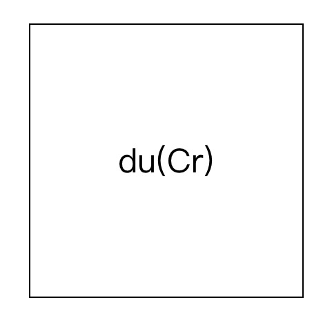
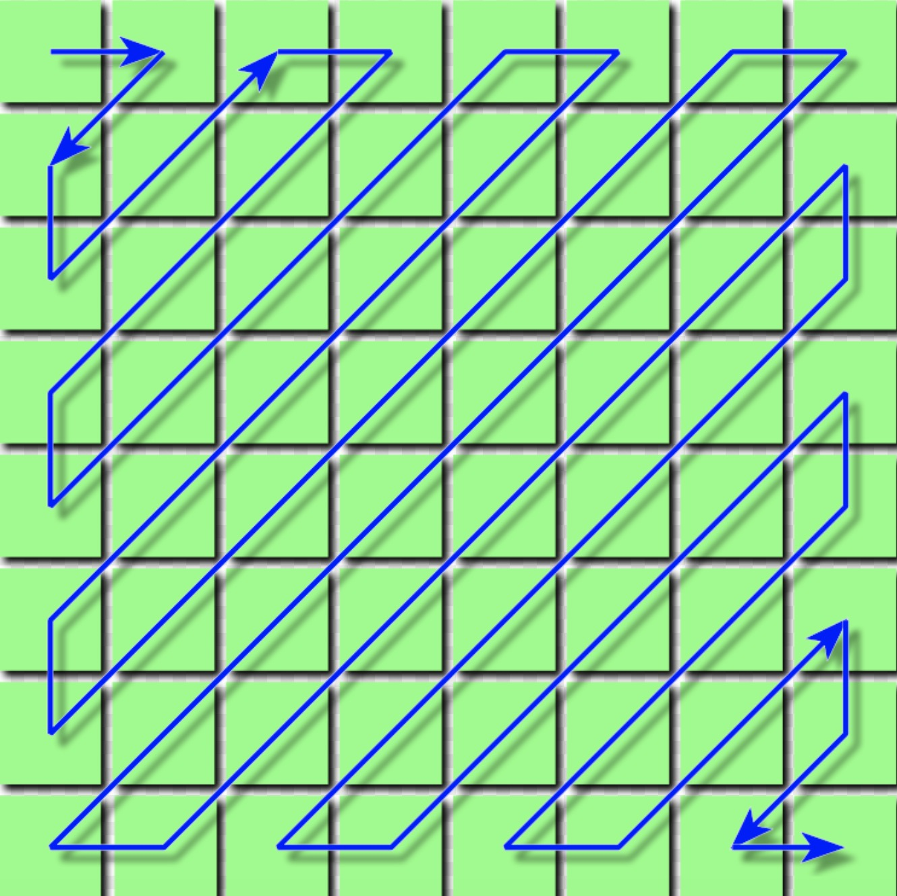

# jpeg的故事：图像的解析流程

## 简介

相信大家对jpeg图片肯定不会陌生，比如我们最常见的照片基本上就是以jpeg来存储的。这得益于jpeg的某个特性——保持高压缩率的同时可以保证人眼的观感不会出现特别大的偏差，尤其这还是基于有损压缩的前提下。接下来就来详细研究下：jpeg图片是如何进行压缩的。

> PS：其实jpeg后来推出过无损压缩的版本，即jpeg2000，可是因为各种各样的原因只在一些特殊渠道比较常见，并没有大规模的流行起来。所以此文就不去涉及jpeg2000了。

## 结构

jpeg图片由各种各样的标记段和图像数据组成。标记段的种类有很多种，但是我们需要重点关注的只有以下几种：

* SOI标记段，即文件头。
* APP0标记段，即应用程序保留标记。
* DQT标记段，存放量化表。
* DHT标记段，存放哈夫曼表。
* SOF0标记段，即帧图像开始标记。
* SOS标记段，即扫描开始标记。
* DRI标记段，即差分编码累计复位的间隔标记。
* COM标记段，即注释。
* EOI标记段，即文件尾。

标记段有着自己的固定结构，如下：

| 描述 | 长度 |
|:---|:---|
| 标记头，固定值为0xff | 1字节 |
| 标记码，用来区分各个标记段 | 1字节 |
| 数据块长度 | 2字节 |
| 数据块内容 | 数据块长度里存放的值 - 2（因为这个值包含了数据块长度的2个字节，故要减2） |

下面介绍各个标记段的时候，就直接介绍标记段里的数据块内容，不再赘述整个标记段的完整结构。整个图片的解码流程如下所示：

```
开始 --> 解析文件头（SOI标记段）--> 解析各种标记段和图像数据 --> 解析完毕之后开始进行图像解码 --> 拼装图像数据到某个特殊结构 --> 哈夫曼解码 --> 反量化 --> zig-zag反编码 --> 反dct变换 --> 转换颜色模型到rgb --> 拼装成图像显示 --> 结束
```

### SOI标记段

jpeg文件头，跟其他文件的文件头类似，表明这是一个jpeg文件。固定值`[0xff, 0xd8]`。

### APP0标记段

此标记段主要存储了图片规格相关信息，标记码是`0xe0`。数据块结构如下：

| 描述 | 长度 |
|:---|:---|
| 文件交换格式，值通常是JFIF0，JPEG File Interchange Format的缩写 | 5字节 |
| 主版本号 | 1字节 |
| 次版本号 | 1字节 |
| 水平方向像素密度 | 2字节 |
| 垂直方向像素密度 | 2字节 |
| 缩略图宽度 | 1字节 |
| 缩略图高度 | 1字节 |
| 缩略图数据 | (缩略图宽度 * 缩略图高度 * 3)字节，直接存放rgb颜色模型数据 |

### DQT标记段

此标记段主要存储了量化表信息，标记码是`0xdb`。数据块结构如下：

| 描述 | 长度 |
|:---|:---|
| 量化表精度，0 - 1字节，1 - 2字节 | 4位 |
| 量化表id，取值范围为0 - 3，所以最多可有4个量化表 | 4位 |
| 量化表内容 | (精度 + 1) * 64字节 |

> PS：这里需要注意的是，上面的结构是一张量化表的内容，但是这个数据块里可能存放至多4张量化表，所以这里的数据块内容可以重复出现。如果出现了多张量化表，则直接将后面的量化表内容追加到上一张量化表后面既可，例如`量化表1、量化表2、量化表3、量化表4`。

### DHT标记段

此标记段主要存储了哈夫曼表信息，标记码是`0xc4`。数据块结构如下：

| 描述 | 长度 |
|:---|:---|
| 哈夫曼表类型，0 - DC直流表，1 - AC交流表 | 4位 |
| 哈夫曼表id | 4位 |
| 不同位数的编码个数，每个字节代表一个位数的编码个数 | 16字节 |
| 哈夫曼表内容 | 16个不同位数编码个数之和 |

> PS：同量化表的存储，此处也只是一张哈夫曼表的内容，但是这个数据块可能存放至多4张哈夫曼表。

### SOF0标记段

此标记段主要存储图像的解码必要信息和颜色信息等，标记码是`0xc0`。数据块结构如下：

| 描述 | 长度 |
|:---|:---|
| 样本精度，通常值为8，样本就是单个像素的颜色分量 | 1字节 |
| 图片高度 | 2字节 |
| 图片宽度 | 2字节 |
| 颜色分量数，1 - 灰度图，3 - YCrCb/YIQ 彩色图，4 - CMYK 彩色图，通常值为3 | 1字节 |
| 颜色分量信息 | (颜色分量数 * 3)字节 |

其中颜色分量信息里存储的结构如下：

| 描述 | 长度 |
|:---|:---|
| 颜色分量id，1 - Y，2 - Cb，3 - Cr，4 - I，5 - Q | 1字节 |
| 水平采样系数 | 4位 |
| 垂直采样系数 | 4位 |
| 量化表id | 1字节 |

### SOS标记段

此标记段标记着图像数据的扫描开始，标记码是`0xda`。数据块结构如下：

| 描述 | 长度 |
|:---|:---|
| 颜色分量数，1 - 灰度图，3 - YCrCb或YIQ，4 - CMYK | 1字节 |
| 颜色分量信息 | (颜色分量数 * 2)字节 |
| 谱相关信息，基本不用考虑此字段 | 3字节 |

其中颜色分量信息里存储的结构如下：

| 描述 | 长度 |
|:---|:---|
| 颜色分量id，1 - Y，2 - Cb，3 - Cr，4 - I，5 - Q | 1字节 |
| DC哈夫曼表id | 4位 |
| AC哈夫曼表id | 4位 |

出现了这个标记段后，就表示后面跟着的就是图像数据了。

### DRI标记段

此标记段存储mcu单元的复位间隔，标记码是`0xdd`。数据块结构如下：

| 描述 | 长度 |
|:---|:---|
| 间隔，表明每多少个mcu单元就会出现一个复位标记 | 2字节 |

### COM标记段

此标记段存储的是注释，标记码是`0xfe`。解码时基本上不用考虑这个标记段里的内容。

### EOI

jpeg文件尾，值固定为`[0xff, 0xd9]`，当遇到此标记段即标明解码结束。

## 拼装

上面虽然扯了一堆标记段的结构，但是只看上面的内容估计很难理解这些标记段有啥公用，所以下面来讲讲图像的整个解码流程，看看如何将这些标记段的内容用上。

### 颜色模型

区别于通常使用rgb的png和gif，jpeg通常是使用YCrCb颜色模型。YCrCb和rgb一样，同样包含3个颜色分量，Y、Cr和Cb分别是指亮度、红色色度偏移和蓝色色度偏移。采用这种颜色模型是因为科学表明人眼对于亮度比色度敏感的多，所以我们在肉眼难以发觉多情况下对色度分量做尽可能多压缩。

```javascript
// rgb转YCrCb
function rgb2YCrCb(rgb) {
    return [
        0.299 * rgb[0] + 0.587 * rgb[1] + 0.114 * rgb[2],
        0.5 * rgb[0] - 0.4187 * rgb[1] - 0.0813 * rgb[2] + 128,
        - 0.1687 * rgb[0] - 0.3313 * rgb[1] + 0.5 * rgb[2] + 128,
    ];
}

// YCrCb转rgb
function YCrCb2rgb(YCrCb) {
    let r = YCrCb[0] + 1.402 * (YCrCb[1] - 128);
    let g = YCrCb[0] - 0.34414 * (YCrCb[2] - 128) - 0.71414 * (YCrCb[1] - 128);
    let b = YCrCb[0] + 1.772 * (YCrCb[2] - 128);

    return [
        r > 255 ? 255 : r < 0 ? 0 : ~~r,
        g > 255 ? 255 : g < 0 ? 0 : ~~g,
        b > 255 ? 255 : b < 0 ? 0 : ~~b,
    ];
}
```

### 获取图像数据

前面有说到，在解析完SOS标记段后，跟着解析到的数据就是图像数据了。这里的解析过程中（包括解析数据段和解析图像数据时都需要考虑）有个特殊的值需要特殊处理，即——`0xff`。当遇到`0xff`这个字节时，需要结合下一个字节的值来判断处理方式：

* 下一个字节为`0xff`：跳过这个`0xff`字节，不做任何处理。
* 下一个字节为`0x00`：表明这个`0xff`是图像数据里的一部分，跳过`0x00`，将`0xff`计入到图像数据中。
* 下一个字节为`0xd0`到`0xd7`：表明遇到了图像数据中的复位标记，记录复位标记在图像中的位置。
* 下一个字节为其他值：遇到了其他标记段，则开始按照标记段的结构开始解析数据。

### 图像数据的排列

当收集完图像数据后，要对图像数据分块处理。说到分块，不得不先提一下jpeg的图像数据的组织方式。在前面讲到DRI标记段的时候，会记录一个间隔，表明在解码图像数据的时候需要遇到多少个mcu才进行一次复位操作。

#### mcu

mcu（Minimum Coded Unit）是最小编码单元，由若干个du（Data Unit）——数据单元构成。那么问题又来了，一个du是指的什么？

这个例子里是一个`16 * 16`的图片，每个像素存放的是YCrCb颜色模型，通常一个颜色分量占用1个字节，那么这里一个像素就占用3个字节，整张图片的像素内容就占用了`16 * 16 * 3`个字节：

```
YCrCb, YCrCb, YCrCb, YCrCb, YCrCb, YCrCb, YCrCb, YCrCb, YCrCb, YCrCb, YCrCb, YCrCb, YCrCb, YCrCb, YCrCb, YCrCb, 
YCrCb, YCrCb, YCrCb, YCrCb, YCrCb, YCrCb, YCrCb, YCrCb, YCrCb, YCrCb, YCrCb, YCrCb, YCrCb, YCrCb, YCrCb, YCrCb,
YCrCb, YCrCb, YCrCb, YCrCb, YCrCb, YCrCb, YCrCb, YCrCb, YCrCb, YCrCb, YCrCb, YCrCb, YCrCb, YCrCb, YCrCb, YCrCb,
YCrCb, YCrCb, YCrCb, YCrCb, YCrCb, YCrCb, YCrCb, YCrCb, YCrCb, YCrCb, YCrCb, YCrCb, YCrCb, YCrCb, YCrCb, YCrCb,
YCrCb, YCrCb, YCrCb, YCrCb, YCrCb, YCrCb, YCrCb, YCrCb, YCrCb, YCrCb, YCrCb, YCrCb, YCrCb, YCrCb, YCrCb, YCrCb,
YCrCb, YCrCb, YCrCb, YCrCb, YCrCb, YCrCb, YCrCb, YCrCb, YCrCb, YCrCb, YCrCb, YCrCb, YCrCb, YCrCb, YCrCb, YCrCb,
YCrCb, YCrCb, YCrCb, YCrCb, YCrCb, YCrCb, YCrCb, YCrCb, YCrCb, YCrCb, YCrCb, YCrCb, YCrCb, YCrCb, YCrCb, YCrCb,
YCrCb, YCrCb, YCrCb, YCrCb, YCrCb, YCrCb, YCrCb, YCrCb, YCrCb, YCrCb, YCrCb, YCrCb, YCrCb, YCrCb, YCrCb, YCrCb,
YCrCb, YCrCb, YCrCb, YCrCb, YCrCb, YCrCb, YCrCb, YCrCb, YCrCb, YCrCb, YCrCb, YCrCb, YCrCb, YCrCb, YCrCb, YCrCb,
YCrCb, YCrCb, YCrCb, YCrCb, YCrCb, YCrCb, YCrCb, YCrCb, YCrCb, YCrCb, YCrCb, YCrCb, YCrCb, YCrCb, YCrCb, YCrCb,
YCrCb, YCrCb, YCrCb, YCrCb, YCrCb, YCrCb, YCrCb, YCrCb, YCrCb, YCrCb, YCrCb, YCrCb, YCrCb, YCrCb, YCrCb, YCrCb,
YCrCb, YCrCb, YCrCb, YCrCb, YCrCb, YCrCb, YCrCb, YCrCb, YCrCb, YCrCb, YCrCb, YCrCb, YCrCb, YCrCb, YCrCb, YCrCb,
YCrCb, YCrCb, YCrCb, YCrCb, YCrCb, YCrCb, YCrCb, YCrCb, YCrCb, YCrCb, YCrCb, YCrCb, YCrCb, YCrCb, YCrCb, YCrCb,
YCrCb, YCrCb, YCrCb, YCrCb, YCrCb, YCrCb, YCrCb, YCrCb, YCrCb, YCrCb, YCrCb, YCrCb, YCrCb, YCrCb, YCrCb, YCrCb,
YCrCb, YCrCb, YCrCb, YCrCb, YCrCb, YCrCb, YCrCb, YCrCb, YCrCb, YCrCb, YCrCb, YCrCb, YCrCb, YCrCb, YCrCb, YCrCb,
YCrCb, YCrCb, YCrCb, YCrCb, YCrCb, YCrCb, YCrCb, YCrCb, YCrCb, YCrCb, YCrCb, YCrCb, YCrCb, YCrCb, YCrCb, YCrCb, 
```

一个du是一个固定的`8 * 8`的矩阵结构，占用`8 * 8 * 1`个字节，每个du只存相同分量的信息，那么上面这个例子可以拆分成`4 * 3`个du，这里乘以一个3的含义就在于每个像素包含3个颜色分量。拆分方式如下：

```
YCrCb, YCrCb, YCrCb, YCrCb, YCrCb, YCrCb, YCrCb, YCrCb, ||  YCrCb, YCrCb, YCrCb, YCrCb, YCrCb, YCrCb, YCrCb, YCrCb, 
YCrCb, YCrCb, YCrCb, YCrCb, YCrCb, YCrCb, YCrCb, YCrCb, ||  YCrCb, YCrCb, YCrCb, YCrCb, YCrCb, YCrCb, YCrCb, YCrCb,
YCrCb, YCrCb, YCrCb, YCrCb, YCrCb, YCrCb, YCrCb, YCrCb, ||  YCrCb, YCrCb, YCrCb, YCrCb, YCrCb, YCrCb, YCrCb, YCrCb,
YCrCb, YCrCb, YCrCb, YCrCb, YCrCb, YCrCb, YCrCb, YCrCb, ||  YCrCb, YCrCb, YCrCb, YCrCb, YCrCb, YCrCb, YCrCb, YCrCb,
YCrCb, YCrCb, YCrCb, YCrCb, YCrCb, YCrCb, YCrCb, YCrCb, ||  YCrCb, YCrCb, YCrCb, YCrCb, YCrCb, YCrCb, YCrCb, YCrCb,
YCrCb, YCrCb, YCrCb, YCrCb, YCrCb, YCrCb, YCrCb, YCrCb, ||  YCrCb, YCrCb, YCrCb, YCrCb, YCrCb, YCrCb, YCrCb, YCrCb,
YCrCb, YCrCb, YCrCb, YCrCb, YCrCb, YCrCb, YCrCb, YCrCb, ||  YCrCb, YCrCb, YCrCb, YCrCb, YCrCb, YCrCb, YCrCb, YCrCb,
YCrCb, YCrCb, YCrCb, YCrCb, YCrCb, YCrCb, YCrCb, YCrCb, ||  YCrCb, YCrCb, YCrCb, YCrCb, YCrCb, YCrCb, YCrCb, YCrCb,

==================================================================================================================

YCrCb, YCrCb, YCrCb, YCrCb, YCrCb, YCrCb, YCrCb, YCrCb, ||  YCrCb, YCrCb, YCrCb, YCrCb, YCrCb, YCrCb, YCrCb, YCrCb,
YCrCb, YCrCb, YCrCb, YCrCb, YCrCb, YCrCb, YCrCb, YCrCb, ||  YCrCb, YCrCb, YCrCb, YCrCb, YCrCb, YCrCb, YCrCb, YCrCb,
YCrCb, YCrCb, YCrCb, YCrCb, YCrCb, YCrCb, YCrCb, YCrCb, ||  YCrCb, YCrCb, YCrCb, YCrCb, YCrCb, YCrCb, YCrCb, YCrCb,
YCrCb, YCrCb, YCrCb, YCrCb, YCrCb, YCrCb, YCrCb, YCrCb, ||  YCrCb, YCrCb, YCrCb, YCrCb, YCrCb, YCrCb, YCrCb, YCrCb,
YCrCb, YCrCb, YCrCb, YCrCb, YCrCb, YCrCb, YCrCb, YCrCb, ||  YCrCb, YCrCb, YCrCb, YCrCb, YCrCb, YCrCb, YCrCb, YCrCb,
YCrCb, YCrCb, YCrCb, YCrCb, YCrCb, YCrCb, YCrCb, YCrCb, ||  YCrCb, YCrCb, YCrCb, YCrCb, YCrCb, YCrCb, YCrCb, YCrCb,
YCrCb, YCrCb, YCrCb, YCrCb, YCrCb, YCrCb, YCrCb, YCrCb, ||  YCrCb, YCrCb, YCrCb, YCrCb, YCrCb, YCrCb, YCrCb, YCrCb,
YCrCb, YCrCb, YCrCb, YCrCb, YCrCb, YCrCb, YCrCb, YCrCb, ||  YCrCb, YCrCb, YCrCb, YCrCb, YCrCb, YCrCb, YCrCb, YCrCb, 
```

一个du就是类似如下的矩阵：

```
Y Y Y Y Y Y Y Y              Cb Cb Cb Cb Cb Cb Cb Cb              Cr Cr Cr Cr Cr Cr Cr Cr
Y Y Y Y Y Y Y Y              Cb Cb Cb Cb Cb Cb Cb Cb              Cr Cr Cr Cr Cr Cr Cr Cr
Y Y Y Y Y Y Y Y              Cb Cb Cb Cb Cb Cb Cb Cb              Cr Cr Cr Cr Cr Cr Cr Cr
Y Y Y Y Y Y Y Y       or     Cb Cb Cb Cb Cb Cb Cb Cb      or      Cr Cr Cr Cr Cr Cr Cr Cr
Y Y Y Y Y Y Y Y              Cb Cb Cb Cb Cb Cb Cb Cb              Cr Cr Cr Cr Cr Cr Cr Cr
Y Y Y Y Y Y Y Y              Cb Cb Cb Cb Cb Cb Cb Cb              Cr Cr Cr Cr Cr Cr Cr Cr
Y Y Y Y Y Y Y Y              Cb Cb Cb Cb Cb Cb Cb Cb              Cr Cr Cr Cr Cr Cr Cr Cr
Y Y Y Y Y Y Y Y              Cb Cb Cb Cb Cb Cb Cb Cb              Cr Cr Cr Cr Cr Cr Cr Cr
```

那么，一个mcu里有多少个du呢？这个由上面解析SOF0标记段时得到的各个颜色分量的采样系数来决定的。通常情况下，Y的水平和垂直采样系数都为2，Cr和Cb的水平和垂直采样系数都为1。这也就意味着，一个mcu里`Y的du数量 : Cr的du数量 : Cb的du数量`为`(2 * 2) : (1 * 1) : (1 * 1)`，也就是说我们要舍弃一些du，以达到压缩的效果。mcu的宽度和高度取决于采样系数最大的哪个颜色分量，因此通常mcu的宽是2个du大小，高也是2个du大小，如下所示：

```
YCrCb, Y, Y, Y, YCrCb, Y, Y, Y, ||  YCrCb, Y, Y, Y, YCrCb, Y, Y, Y,
YCrCb, Y, Y, Y, YCrCb, Y, Y, Y, ||  YCrCb, Y, Y, Y, YCrCb, Y, Y, Y,
YCrCb, Y, Y, Y, YCrCb, Y, Y, Y, ||  YCrCb, Y, Y, Y, YCrCb, Y, Y, Y,
YCrCb, Y, Y, Y, YCrCb, Y, Y, Y, ||  YCrCb, Y, Y, Y, YCrCb, Y, Y, Y,
YCrCb, Y, Y, Y, YCrCb, Y, Y, Y, ||  YCrCb, Y, Y, Y, YCrCb, Y, Y, Y,
YCrCb, Y, Y, Y, YCrCb, Y, Y, Y, ||  YCrCb, Y, Y, Y, YCrCb, Y, Y, Y,
YCrCb, Y, Y, Y, YCrCb, Y, Y, Y, ||  YCrCb, Y, Y, Y, YCrCb, Y, Y, Y,
YCrCb, Y, Y, Y, YCrCb, Y, Y, Y, ||  YCrCb, Y, Y, Y, YCrCb, Y, Y, Y,

==================================================================

YCrCb, Y, Y, Y, YCrCb, Y, Y, Y, ||  YCrCb, Y, Y, Y, YCrCb, Y, Y, Y,
YCrCb, Y, Y, Y, YCrCb, Y, Y, Y, ||  YCrCb, Y, Y, Y, YCrCb, Y, Y, Y,
YCrCb, Y, Y, Y, YCrCb, Y, Y, Y, ||  YCrCb, Y, Y, Y, YCrCb, Y, Y, Y,
YCrCb, Y, Y, Y, YCrCb, Y, Y, Y, ||  YCrCb, Y, Y, Y, YCrCb, Y, Y, Y,
YCrCb, Y, Y, Y, YCrCb, Y, Y, Y, ||  YCrCb, Y, Y, Y, YCrCb, Y, Y, Y,
YCrCb, Y, Y, Y, YCrCb, Y, Y, Y, ||  YCrCb, Y, Y, Y, YCrCb, Y, Y, Y,
YCrCb, Y, Y, Y, YCrCb, Y, Y, Y, ||  YCrCb, Y, Y, Y, YCrCb, Y, Y, Y,
YCrCb, Y, Y, Y, YCrCb, Y, Y, Y, ||  YCrCb, Y, Y, Y, YCrCb, Y, Y, Y,
```

可以看到，像第2、第3、第4个像素点的CrCb分量已经舍弃了，假如要解析的话这几个像素点就直接应用第1个像素点的CrCb值；以此类推，第6、第7、第8个像素点就直接使用第5个像素点的CrCb值……可以明显的看到，这里对颜色分量的舍弃压缩了一半的图像数据。

这样，可以得出mcu里总共包含6个du——4个Y分量的du，1个Cr分量的du，1个Cb分量的du。

#### 排列方式

mcu和du的排列方式都是自左向右，自上向下。

假设按照上面解析出来的采样系数，我们可知一个mcu里有6个du，宽高均为16。而这里有一张`35 * 35`的图片，那么mcu的排列如下：


图中灰色区域是图片的实际大小，里面有9个mcu。我想只看图就能明白了，一个mcu高度为16，而图片高度为35的话，显然2个mcu上不够的，所以在垂直方向需要补齐到足够的mcu才行；同理水平方向也需要补齐。

mcu里的du排列方式也相似，只是mcu大小本身由du和采样系数决定，不需要做补齐操作：




拍平后，mcu的存储方式就变成这样`du1(Y), du2(Y), du3(Y), du4(Y), du(Cb), du(Cr)`，所以我们解析图像数据实际上是先解析出du，然后根据这个规律讲du拼装成mcu，然后再将mcu拼装成图片显示出来。

#### 复位间隔

说完mcu和du，说回这个复位间隔问题。每个du里存在着一个比较特别的系数，人称DC系数，这个系数通常存储的是和上一个DC系数的差值，除了第一个DC系数会存真实值（即对DC系数进行了差分编码）。而如果一直存差值的话，会让存储的值越来越大，因为复位其实就是告诉我们这个du里存的不是DC系数的差值，而是真实值。

至于DC系数是个什么玩意，下面再做说明。

## 解码

解码这里有一个关键点要注意：下面的解码流程都是以1个du为单位进行的。

### 哈夫曼解码

因为对du的最后一个操作上哈夫曼编码，所以解码流程中首先要做的就是哈夫曼解码。而哈夫曼解码过程依赖哈夫曼树，所以还需要先构建出哈夫曼树。

#### 构建哈夫曼树

根据先前解析DHT标记段时得到的哈夫曼表内容和不同位数的编码个数就可以构建出哈夫曼树。其中不同位数的编码个数这里用16个字节来存储，每个字节作为一个独立的值来解析，可以将其转化为一个长度为16的数组。

假设这里我们解析到的值是`[0, 1, 2, 0, 5, 9, 13, 3, 0, 1, 5, 2, 1, 0, 0, 0]`，那么就代表着哈夫曼编码里编码位数为1的有0个，编码位数为2的有1个，编码位数为3的有2个，编码位数为4的有1个，其它以此类推。这样整个哈夫曼树的编码个数我们也可以知悉，即`0 + 1 + 2 + 0 + 5 + 9 + 13 + 3 + 0 + 1 + 5 + 2 + 1 + 0 + 0 + 0`个，也就是42个，那么哈夫曼表内容也就占43个字节。

哈夫曼编码是以0为起点的，接着上面的例子来说，因为编码位数为1的有0个，编码位数为2的有1个，那么这棵哈夫曼树里的第一个编码是`00`。注意这里是`00`两位编码，而不是`0`一位编码，因为这棵哈夫曼树里的第一个编码位数是2位的。后面的编码也很好推了，将上一个编码加1，然后补齐对应的位数即可，整棵树解析出来大概如下表：

| 编码 | 值 |
|:---|:---|
| 00 | 哈夫曼表内容里第1个字节的值 |
| 010 | 哈夫曼表内容里第2个字节的值 |
| 011 | 哈夫曼表内容里第3个字节的值 |
| 10000 | 哈夫曼表内容里第4个字节的值 |
| 10001 | 哈夫曼表内容里第5个字节的值 |
| 10010 | 哈夫曼表内容里第6个字节的值 |
| 10011 | 哈夫曼表内容里第7个字节的值 |
| 10100 | 哈夫曼表内容里第8个字节的值 |
| 101010 | 哈夫曼表内容里第9个字节的值 |
| 101011 | 哈夫曼表内容里第10个字节的值 |
| ... | ... |

由例子可以发现，补齐的操作主要是发生在编码位数变化的时候，比如从3位变成5位时，将原本的值加1，如果位数不够则在编码后面补0。所以当上一个编码是`011`而下一个编码是5位时，要先将`011`加1得`100`，然后在编码后面补充2位`0`，得到的`10000`便是当前的编码了。代码实现如下：

```javascript
// 重复字符串若干次
function repeatString(str, count) {
    return (new Array(count + 1)).join(str);
}

// 构建哈夫曼树
function constructHuffmanTree(chunk, countArray) {
    let ret = {};

    let last;
    for (let i = 0, length = countArray.length; i < length; i++) {
        let count = countArray[i];
        for (let j = 0; j < count; j++) {
            if (last === undefined) {
                // 初始化第一个编码
                last = repeatString('0', i + 1);
            } else {
                // 将上一个编码+1
                let lastLength = last.length;
                last = (parseInt(last, 2) + 1).toString(2);

                if (last.length < lastLength) {
                    // 位数不够前置补0
                    last = repeatString('0', lastLength - last.length) + last;
                }

                if (last.length < i + 1) {
                    // 位数不够后置补0
                    last = last + repeatString('0', i + 1 - last.length);
                }
            }

            ret[last] = {
                group: last.length,
                value: chunk.shift()
            };
        }
    }

    return ret;
}
```

#### 解码

有了哈夫曼树，就可以开始哈夫曼解码流程了。前面有说到一个du是`8 * 8`的大小，但里面不是直接存储的颜色相关值，而是颜色值经过dct变换后的系数。简单来说，存储结构如下：

```
DC AC AC AC AC AC AC AC
AC AC AC AC AC AC AC AC
AC AC AC AC AC AC AC AC
AC AC AC AC AC AC AC AC
AC AC AC AC AC AC AC AC
AC AC AC AC AC AC AC AC
AC AC AC AC AC AC AC AC
AC AC AC AC AC AC AC AC
```

系数有两种，DC系数和AC系数。DC系数是指du里左上角的那个值，其他系数都是AC系数。实际上DC系数那里也不是真的存DC系数的真实值，而是存储与上一个DC的差值，因为DC系数这里进行了差分编码，这个上面已经解释过，这里就不再赘述了。

这里要区分两种系数的原因除了DC系数存储差值外，还因为两种系数使用的是不同的哈夫曼树。前面有提到过哈夫曼表最多可以有4张，即可构建出4棵哈夫曼树，分别是：Y分量的DC系数用、Y分量的AC系数用、CrCb分量的DC系数用和CrCb分量的AC系数用。

#### DC系数

拿到哈夫曼树和图像数据后解码DC系数的具体流程如下：

1. 根据哈夫曼树从图像数据中解析出一个被编码的值n。
2. 从图像数据中取出n位数据，转换成整型数值m。
3. 根据n、m和上一个DC系数计算出当前的DC系数。

只看流程有点绕，可以用一个简单点的例子来介绍下这个流程，首先假设哈夫曼树和图像数据如下：

```
# DC哈夫曼树
{
    '11': 2,
    '100': 3
    ...
}

# AC哈夫曼树

{
    '100': 68,
    ...
}

# 图像数据
11101000011...
```

那么第一步就是要解析出一个被编码的值，遍历一遍哈夫曼树的key可以解析出这个key是11，对应的值n为2。那么就从图像数据中去掉被解析过的key之后再取n位，也就是2位——10，转成对应的m值，也就是2。接下来要根据n和m来计算DC系数，因此我们得知道这么一张表：

```
// 层号n               值
// 0                   0
// 1                 -1, 1
// 2             -3, -2, 2, 3
// 3        -7, ..., -4, 4, ..., 7
// 4       -15, ..., -8, 8, ..., 15
```

这张表是金字塔式的表，层号n由0开始往下递增，每一层的数字个数就是`2^n`，范围是`1 - 2^n ~ -2^(n - 1)`和`2^(n - 1) ~ 2^n - 1`。上面解析出来的n为2，m也为2，假设上一个DC系数是10，那么当前DC系数就等于上表中第n层的第m个数值再加上上一个DC系数，也就是`2 + 10`，即12。

#### AC系数

AC系数的解码和DC系数类似，但是稍微复杂一点。流程如下：

1. 根据哈夫曼树从图像数据中解析出一个被编码的值a。
2. 将a一分为二，前4位转成整型数值z，后4位转成整型数值n。
3. 判断数值对，如果z和n都为0，则表示当前du后面的全部AC系数都是0；否则继续解析。
4. z表示当前AC系数前面有多少个值为0的AC系数，针对这些AC系数就没有解码的必要了，因为它们的值就是0。
5. 从图像数据中取出n位数据，转换成整型数值m。
6. 根据n、m计算出当前的AC系数。

同样用上面的例子来解释一下，假设当前du已经解析出DC系数，值为12，接下来开始解析AC系数：

1. 取出值a，也就是key为100，值为68。
2. 将a一分为二，a值为68，转成8位二进制串是01000100，前4位为z值4，后4位为n值4。
3. 因为z值为4，表示当前AC系数前面有4个值为0的AC系数。
4. 从图像数据中取出n位数据，也就是4位数据——0011，转成十进制是3，记为m值。
5. 和DC系数的计算方式差不多，根据n、m和金字塔表得出当前AC系数为-12。

因为AC系数含有比较多的0，所以再哈夫曼编码的时候就使劲的压缩。像例子中这次AC系数解码，一次性就解出了5个AC系数：`0, 0, 0, 0, -12`。

> PS：1个du里包含1个DC系数和63个AC系数，所以假如已经解析出50个AC系数后遇到了z值和n值都为0的情况，就表示剩下的13个AC系数都是0。

### 反量化

反量化的过程很简单，假设为我有一个du和一张量化表，反量化就是将它们对应位置的数值相乘即可：

```
# du
DC0, AC1, AC2, AC3, AC4, ...

# 量化表
Q0, Q1, Q2, Q3, Q4, ...

# 反量化后的结果
DC0 * Q0, AC1 * Q1, AC2 * Q2, AC3 * Q3, AC4 * Q4, ...
```

### zig-zag反编码

什么叫zig-zag编码？假设我们有一个`8 * 8`的矩阵，做zig-zag编码后会变成一个64位的数组：

```
 1  2  3  4  5  6  7  8
 9 10 11 12 13 14 15 16
17 18 19 20 21 22 23 24                          1, 2, 9, 17, 10, 3, 4, 11, 18, 25 33, 26, 19, 12, 5,
25 26 27 28 29 30 31 32     经过zig-zag编码后     6, 13, 20, 27, 34, 41, 49, 42, 35, 28, 21, 14, 7, 8, 
33 34 35 36 37 38 39 40                          15, 22, ...
41 42 43 44 45 46 47 48
49 50 51 52 53 54 55 56
57 58 59 60 61 62 63 64
```

用一张图来说明就是：



zig-zag编码是为了让du中的散列的0变成更加连续，这样的话在进行哈夫曼编码的时候就可以比较好的压缩图像数据了。而zig-zag反编码就是对上述编码进行逆向操作即可：

```javascript
// 用于进行zig-zag编码
const ZIG_ZAG = [
    0,  1,  5,  6,  14, 15, 27, 28,
    2,  4,  7,  13, 16, 26, 29, 42,
    3,  8,  12, 17, 25, 30, 41, 43,
    9,  11, 18, 24, 31, 40, 44, 53,
    10, 19, 23, 32, 39, 45, 52, 54,
    20, 22, 33, 38, 46, 51, 55, 60,
    21, 34, 37, 47, 50, 56, 59, 61,
    35, 36, 48, 49, 57, 58, 62, 63,
];

function reverseZigZag(input) {
    let output = [];

    for (let i=0; i < 64; i++) {
        output[i] = input[ZIG_ZAG[i]];
    }

    return output;
}
```

### 反dct变换

dct变换，即离散余弦变换，傅立叶变换中的一种，要点是可以将任意一个数字信号转换成一个余弦函数组合。

人眼对图像中低频区域敏感，而对高频区域不敏感。由于dct变换具有很强的“能量集中”特性：大多数的自然信号（包括声音和图像）的能量都集中在dct变换后的低频区域。那么我们就可以对图像的高频区域进行压缩（这部分就会被量化成0，然后被哈夫曼编码压缩）。关于dct更为详细的介绍可以参考[维基百科](https://en.wikipedia.org/wiki/Discrete_cosine_transform)，下面仅奉上相关代码：

```javascript
// 矩阵相乘
function multiplyMatrix(a, b) {
    // do sth
}

// dct
function dct(input) {
    let transform = []; // 变换矩阵
    let transformT = []; // 变换矩阵的转置矩阵

    // 初始化矩阵
    for (let i = 0; i < 8; i++) {
        transform[i] = [];
        transformT[i] = [];
    }

    // 生成变换矩阵
    for (let i = 0; i < 8; i++) {
        for (let j = 0; j < 8; j++) {
            let a = j === 0 ? Math.sqrt(1 / 8) : Math.sqrt(2 / 8);

            transform[i][j] = a * Math.cos(Math.PI * (i + 0.5) * j / 8);
            transformT[j][i] = transform[i][j];
        }
    }

    return multiplyMatrix(multiplyMatrix(transform, input), transformT);
}

// 反dct
function idct(input) {
    let transform = []; // 变换矩阵
    let transformT = []; // 变换矩阵的转置矩阵

    // 初始化矩阵
    for (let i = 0; i < 8; i++) {
        transform[i] = [];
        transformT[i] = [];
    }

    // 生成变换矩阵
    for (let i = 0; i < 8; i++) {
        for (let j = 0; j < 8; j++) {
            let a = j === 0 ? Math.sqrt(1 / 8) : Math.sqrt(2 / 8);

            transform[i][j] = a * Math.cos(Math.PI * (i + 0.5) * j / 8);
            transformT[j][i] = transform[i][j];
        }
    }

    return multiplyMatrix(multiplyMatrix(transformT, input), transform);
}
```

反dct变换即是dct变换的逆操作。经过反dct变换后一个du的解码就算完成了，当所有du解码完毕后就可以按照上文所写的拼装成mcu，然后再拼装成完整的图像。

> PS：关于dct变换和反dct变换，有个更为快速的算法——蝶形算法，相关可参阅文章[http://www.cnblogs.com/xkfz007/archive/2012/07/31/2616791.html](http://www.cnblogs.com/xkfz007/archive/2012/07/31/2616791.html)。

## 尾声

此文只对jpeg图片的格式做了简单的介绍，我们也知道如何对一张gif图做简单的解析。上面出现的代码只是js代码片段，如果对完整代码有兴趣的同学可以[戳这里](https://github.com/JuneAndGreen/doimg/blob/master/src/jpeg.js)。

参考资料：

* [https://www.codingnow.com/2000/download/jpeg.txt](https://www.codingnow.com/2000/download/jpeg.txt)
* [https://en.wikipedia.org/wiki/JPEG](https://en.wikipedia.org/wiki/JPEG)
* [https://en.wikipedia.org/wiki/Discrete_cosine_transform](https://en.wikipedia.org/wiki/Discrete_cosine_transform)
