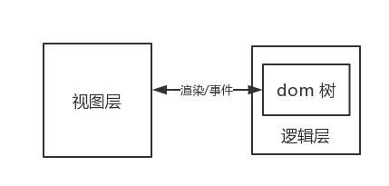
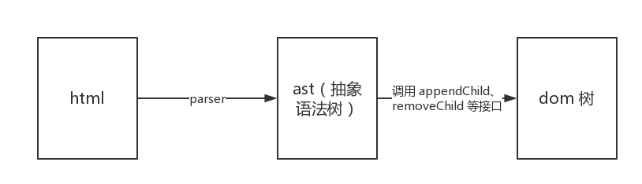

# 论如何将 h5 页面快速转换成微信小程序

## 前言

微信小程序自开放出来到现在也有一段时间了，相信其底层架构也被琢磨得差不多了。微信小程序本身是双线程运行的结构，而 h5 页面是单线程的运行模式，因此两者无法直接互通。微信小程序的运行模式如下：


微信小程序本身提供了 web-view 组件来支持在微信小程序中嵌入 h5 页面，但是 web-view 组件在使用上还是有一些限制：不支持个人类型与海外类型的小程序、不支持全屏、页面与小程序通信不方便、很多小程序接口无法直接调用等。

如果无法使用 web-view，这里还有一条路可以走，利用 **[h5-to-miniprogram](https://github.com/wechat-miniprogram/h5-to-miniprogram)** 工具来将 h5 页面转换成小程序。

## 起步

假设你已经有一个 h5 页面，包含四个文件：

```
h5 页面
   |---- index.html
   |---- index.css
   |---- index.js
   |---- index.png
```

这种结构我们再熟悉不过了，具体每个文件的内容可参考这里：[https://github.com/wechat-miniprogram/h5-to-miniprogram-demo/tree/master/h5](https://github.com/wechat-miniprogram/h5-to-miniprogram-demo/tree/master/h5)。页面渲染出来的效果如下：


页面很简单，但是值得一提的时，这个页面引入了 jQuery 库，所以 index.html 和 index.js 是这样的：

```html
<!doctype html>
<html lang="zh">
  <head>
    <meta charset="utf-8">
    <meta name="viewport" content="width=device-width, initial-scale=1, user-scalable=no, minimal-ui">
    <meta content="yes" name="apple-mobile-web-app-capable">
    <meta content="black" name="apple-mobile-web-app-status-bar-style">
    <meta name="format-detection" content="telephone=no, email=no">
    <title>demo</title>
    <style type="text/css">
      html, body {
        width: 100%;
        height: 100%;
      }
    </style>
    <link rel="stylesheet" href="./index.css">
  </head>
  <body>
    
    <div class="cnt"></div>
    <script src="https://juneandgreen.github.io/test/h5-to-miniprogram-demo/demo2/js/jquery-1.12.4.min.js"></script>
    <script src="./index.js"></script>
  </body>
</html>
```

```js
$(document).ready(function() {
  $('.cnt').text('h5 to miniprogram');
});
```

微信小程序里是不暴露 dom/bom 接口的，说想要使用 jQuery 是非常困难的。尽管难以置信，但是确实是有办法的，后面会简述一下原理，让我先继续看下要如何操作。

## 配置

因为运行环境的不同，为了在编译时和运行时对两者进行一些兼容操作，我们需要一份配置文件：

```js
module.exports = {
  index: 'h5', // 首页
  urlMap: { // 每个页面对应的初始 url
    h5: 'https://weixin.qq.com/index?a=1&b=2#hash',
  },
  resFilter(src, pageKey) {
    // 资源过滤，用于替换 h5 中使用到的资源路径
    return pageKey === 'h5' && src === './index.png' ? 'https://raw.githubusercontent.com/wechat-miniprogram/h5-to-miniprogram-demo/master/h5/index.png' : src
  },
}
```

配置文件很简单，就是一个 js 文件，里面包含各种配置项。例如 `index` 配置项用于配置首页；`urlMap` 用于配置每个页面的初始 url，这个 url 会被解析到 window.location 中，通常用于页面跳转或单页系统中；`resFilter` 配置项用于调整资源路径，这里是因为考虑到微信小程序包大小有限制，默认不会去处理图片等资源，所以需要提供一个方法来替换资源路径为网络路径。

因为配置文件需要拷贝到微信小程序项目中执行，所以配置文件必须是一个纯净的没有额外依赖的文件（比如 `require('fs')` 在配置文件中是不允许的）。

## 构建生成

有了原始的 h5，有了配置文件，那就可以开始进行转换并生成微信小程序项目了。我们来编写一个构建脚本，起名为 build.js：

```js
const path = require('path')
const toMiniprogram = require('h5-to-miniprogram')

toMiniprogram({
  entry: { // 入口 h5 页面路径
    h5: path.join(__dirname, './h5/index.html'),
  },
  output: path.join(__dirname, './miniprogram'), // 输出目录
  config: path.join(__dirname, './config.js'), // 配置文件路径
}).then(res => {
  console.log('done')
}).catch(err => {
  console.error(err)
})
```

构建脚本也很简单，引入 [h5-to-miniprogram](https://github.com/wechat-miniprogram/h5-to-miniprogram) 工具，此工具直接暴露一个 async 方法，调用时将必须的参数传入即可。

可以看到参数中的入口配置是一个 key-value 对象，这里的 value 不能理解，就是页面的路径，key 则是页面的名称。例子中这个页面的 key 就是 h5，我们回到上面的配置文件那里就会发现，很多个地方都需要用到这个 key，这个 key 可以作为页面的唯一标识。

写完构建脚本后，后续就简单很多了，执行：

```
node build.js
```

然后就会看到构建脚本中指定的输出目录—— miniprogram 目录被生成出来。完整的 demo 在这里：[https://github.com/wechat-miniprogram/h5-to-miniprogram-demo](https://github.com/wechat-miniprogram/h5-to-miniprogram-demo)

## 使用

使用[官方提供的开发者工具](https://developers.weixin.qq.com/miniprogram/dev/devtools/devtools.html)打开 miniprogram 目录，可以看到已经基本达到我们想要的效果了：


## 原理

原理其实很简单，h5 页面在浏览器运行的过程就是解析 html 到渲染 dom 树的过程，然后提供一些 dom/bom 接口给 js 调用。那么在小程序中我们把这一套给模拟一遍就行了，方法很暴力，但是却意外的有效：因为给 h5 页面提供了类似浏览器的环境，实现了最底层的适配，所以理论上来说那些通用的框架和库也能支持运行。上面的例子中就表明了 jQuery 是能够运行的，像 react、vue 也是可以做到支持的。



微信小程序是双线程的运行模式，视图层专注于渲染，逻辑层专注于逻辑。逻辑层是在一个纯净的 js 线程中跑，那里没有 dom/bom 接口，只能运行页面逻辑层的代码。要模拟浏览器环境，最基本的就是要在逻辑层里模拟出一棵 dom 树，本质上和建立一棵虚拟树类似，因为它并不是真实的 dom 树。整个流程简单来说是这样的：



不管是页面中的静态 html 内容还是使用 innerHTML 等接口动态插入的 html 内容都可以走上面的流程来进行 dom 树的创建。dom 树创建比较简单，只是细节比较多，此处的关键是将创建好的 dom 节点映射到微信小程序的自定义组件，利用自定义组件的特性可以轻易的将我们创建好的 dom 树给渲染出来。

如果你还不清楚微信小程序的自定义组件是什么的话，可以戳[官方文档](https://developers.weixin.qq.com/miniprogram/dev/framework/custom-component/)了解一下。

## 限制

受限于微信小程序本身的运行环境，所以这个转换是无法做到非常完美的，比如动态执行 js 代码、动态插入修改 style 标签等，所以使用此工具后一定要检查转换出来的微信小程序是否符合预期。

## 尾声

本文更多的是为介绍 [h5-to-miniprogram](https://github.com/wechat-miniprogram/h5-to-miniprogram) 工具的使用，后续会有更多实现上的介绍，有兴趣的同学可以尝试一下，有什么好的建议可以在 [issues](https://github.com/wechat-miniprogram/h5-to-miniprogram/issues) 中提出，也欢迎推送 pull request 帮忙将此工具完善起来~

好评请 star 噢~
