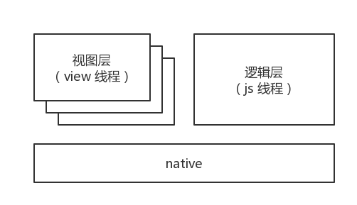

# 论如何进行小程序自定义组件的单元测试

## 前言

自从小程序自定义组件和 npm 功能面世之后，组件化和开源思想逐步开始萌芽了。我们可以将一些通用的部件，如自定义导航栏之类的封装到一个自定义组件中，然后借由 npm 平台开源出去给其他开发者使用，这样可以省去很多劳动。相信各位开发老爷们应该或多或少都有过使用开源包的经历，但是在使用前，这个开源包得能赢取我们的信任，一个很重要的指标就是单元测试通过率和覆盖率。

但是因为小程序独特的运行环境和不完全开源的基础款，使得对小程序自定义组件的单元测试稍微有点困难。目前市面上无论是 vue 还是 react，这些组件化框架都有一套完善的单元测试解决方案，但是对于小程序自定义组件来说却寥寥无几，因此这个工具集—— [miniprogram-simulate](https://github.com/wechat-miniprogram/miniprogram-simulate) 便应运而生了。

## 痛点

闲话不多说，我们先看下小程序的运行机制：



可以看出，小程序自定义组件是渲染与逻辑脱离，想在逻辑层拿到渲染的结果进而进行对比测试是很难办到的。而且目前小程序的环境并不开放，想要完整构造模拟出小程序的运行环境也不太科学。另外我们这边只是需要对小程序的自定义组件做单元测试，对于小程序中很多非自定义组件相关的功能可以不考虑，而且在性能上也不那么苛求，所以一个思路是调整底层运行机制，将双线程合并为一个线程，将 wxml、wxss 的解析器改成纯 js 实现。

## 实现

只是有思路还不够，在实现过程中还是有一些坎的。比如要如何比较好的模拟出小程序自定义组件的各种特性和功能呢？自己实现也不是不行，问题在于维护的成本，如果小程序自定义组件实现了一个功能，测试工具还得更新一下。另外如果在实现上略有差池的话，可能小程序端的一个小调整对于测试工具都可能是伤筋动骨式的改造。所以这里直接将小程序自定义组件的最核心模块—— exparser 从基础库中抽离出来。

exparser 是自定义组件系统的内核，是一个完整独立的模块，不依赖于基础库中其他模块。它完全脱离于小程序的 api 和运行机制体系，所以无论是单线程还是双线程机制都可以使用。exparser 提供的是自定义组件系统最底层的接口，测试工具将其进行二次封装成自定义组件测试环境。如果基础库有关于自定义组件的更新，如果是底层改造，则直接更新 exparser 模块即可；如果只是外层改造，那基本上是暴露接口层面的调整，也不必作太多大范围的调整。

> PS：目前虽然 exparser 已经发布到 npm，但是仍然只是混淆压缩后到代码，属于半开源状态，不建议开发者直接使用。

## 使用

[miniprogram-simulate](https://github.com/wechat-miniprogram/miniprogram-simulate) 本是自定义组件脚手架 [miniprogram-custom-component](https://github.com/wechat-miniprogram/miniprogram-custom-component) 中的一部分，现单独抽离出来，方便开发者们作更多的使用选择（脚手架中默认使用 jest 来搭配使用，直接使用此工具集则可以搭配其他想要使用的测试框架，比如 mocha 等）。

下述只简单介绍下用法，首先安装此工具集：

```
npm install --save-dev miniprogram-simulate
```

然后此工具集必须搭配其他测试框架和 jsdom 来使用，比如 jest。因为 jest 内置有 jsdom，所以也就不需要额外安装 jsdom 了，以下面一个自定义组件作为例子：

```html
<!-- 自定义组件：comp.wxml -->
<view class="index">{{prop}}</view>
```

```css
/* 自定义组件：comp.wxss */
.index {
  color: green;
}
```

```js
// 自定义组件 comp.js
Component({
  properties: {
    prop: {
      type: String,
      value: 'index.properties'
    },
  },
})
```

这是一个极其简单的自定义组件，然后我们在 comp.test.js 里这样编写测试用例：

```js
// 自定义组件 comp 的测试用例：comp.test.js
const path = require('path')
const simulate = require('miniprogram-simulate')

test('comp', () => {
  const id = simulate.load(path.join(__dirname, './comp')) // 此处必须传入绝对路径
  const comp = simulate.render(id) // 渲染成自定义组件树实例

  const parent = document.createElement('parent-wrapper') // 创建父亲节点
  comp.attach(parent) // attach 到父亲节点上，此时会触发自定义组件的 attached 钩子

  expect(comp.querySelector('.index').dom.innerHTML).toBe('index.properties') // 测试渲染结果
})
```

使用方式很简单，本文只是个引子，更多详细的用法请移步到 [github 仓库](https://github.com/wechat-miniprogram/miniprogram-simulate)上查阅。

## 尾声

要想判断一个自定义组件的质量如何，其中最简单的方法就是看单元测试的表现，想要别人使用你的自定义组件，质量把关很重要，目前 miniprogram-simulate 已经实现了最基本的功能，其他功能也在尽力施工中，有什么好的建议或者使用上遇到什么问题也可以提 [issue](https://github.com/wechat-miniprogram/miniprogram-simulate/issues)。如果好评请 star 噢~
