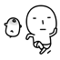
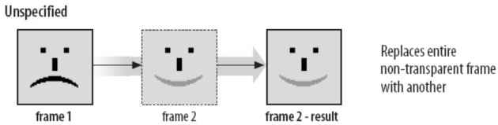
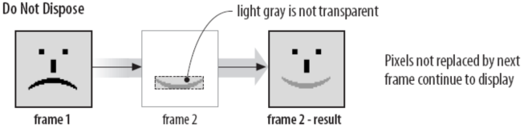
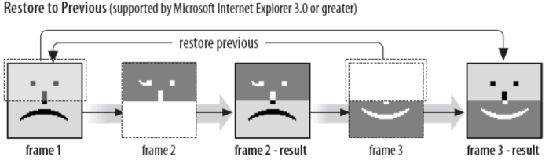

# gif的故事：解剖表情动图的构成

## 前言

在现在表情包横行的年代，相信大家对表情动图已经不陌生了，这些动图通常就是我们使用的gif图（比如下图）。所谓动图就是会动的图片，而其会动的原理跟动画、影视剧一样，通过连续播放图片让我们从视觉感官上认为图片会动。那么gif图片又是如何将动图中的每一帧存储下来的呢，这下就需要我们动起刀子，解剖一下gif图。



## 简介

gif图本身无需过多介绍，相信这个星球上的人类基本上没有没接触过的吧。但是从专业的角度上来介绍的话，gif图是一种基于LZW算法的8位连续色调的无损压缩格式，某种程度上来说和png图的格式有点相似（索引、无损压缩等）。其中LZW算法上一种压缩算法，需要注意的是gif使用的LZW算法并不是原本的LZW算法，而是经过稍微改造后的LZW算法。

## 结构

我们还是使用块来区分gif图的内容，掐去头跟尾，剩下的块可分为九种：逻辑屏幕标识符、全局颜色列表、图形控制扩展块、图像标识符、局部颜色列表、图像数据、文本扩展块、应用扩展块和注释扩展块。

其中其中文本扩展块、应用扩展块和注释扩展块我们基本上用不着，所以这里不做介绍。整个解析流程如下图：


### 文件头

gif图文件头有两种：`[0x47, 0x49, 0x46, 0x38, 0x37, 0x61]`和`[0x47, 0x49, 0x46, 0x38, 0x39, 0x61]`，分别对应87a版本（1987年制定的版本）和89a版本（1989年制定的版本）。这也是这个gif图的“魔数”，我们通过“魔数”就可以判断一个文件是不是gif图，用这种方式比直接判断文件后缀会靠谱得多。当然，我们可以将这个文件头转成字符串，转换过后其实就是"GIF87a"和“GIF89a”，这个文件头的来历其实就是这么的简单：D

### 逻辑屏幕标识符

逻辑屏幕标识符（Logical Screen Descriptor）存放的是整个图片的基础信息，总共7个字节，结构如下：

|描述|长度|
|:---|:---|
|图像宽度|2字节|
|图像高度|2字节|
|全局颜色列表标志|1位|
|图像深度|3位|
|分类标志|1位|
|全局颜色列表大小|3位|
|背景颜色|1字节|
|像素宽高比|1字节|

图像宽高不必说，这里要注意的是解析的方式。宽高都是两个字节的，以小端法存储，故解析的时候需要将这两个字节的数据调换一下再转成数字。比如图像宽度这里存放的数据是`00000000 00100000`，假如我们直接转成数字是32，但是不对的；正确的解析方式是将两个字节调换一下，变成`00100000 00000000`再去解析，得出的图像宽度实际是**8192**才对。

```javascript
// 数字转8位二进制字符串
function numberToString(num) {
    num = num.toString(2).split('');

    while(num.length < 8) {
        num.unshift(0);
    }

    return num.join('');
}

// 读取8位无符号整型数
function readInt8(buffer, offset) {
    offset = offset || 0;
    return buffer[offset] << 0;
}

let chunk = readBytes(7); // 逻辑屏幕标识符块数据，共7个字节

// 需要调换过来读取
let width = parseInt(numberToString(readInt8(chunk, 1)) + numberToString(readInt8(chunk)), 2); // 宽
let height = parseInt(numberToString(readInt8(chunk, 3)) + numberToString(readInt8(chunk, 2)), 2); // 高
```

全局颜色列表标志和分类标志只用1位表示，相当于就是一个布尔值。其中全局颜色列表标志若为1，则表示存在全局颜色列表块；分类标志若为1，则表示全局颜色列表块里的颜色会按重要性进行排列（即使用的频率）。图像深度表示每个像素点占用的位数，其他几个字段看名称就能了解，这里就不做解释（像素宽高比目前也几乎不再支持，可忽略）。

### 全局颜色列表

全局颜色列表（Global Color Table）存放的是全局使用的颜色信息，相当于我们画画用的色板。是否需要解析这个块由逻辑屏幕标识符中的全局颜色列表标志决定，如果存在此块，那么此块的字节数等于`(2 ^ (全局颜色列表大小 + 1)) * 3`。这里乘以3是因为每个颜色有3个通道，即我们熟悉的RGB三色通道。

```javascript
let globalColorTableFlag; // 全局颜色列表标志
let globalColorTableSize; // 全局颜色列表大小

if (globalColorTableFlag === 1) {
    let length = Math.pow(2, globalColorTableSize + 1) * 3;
    let globalColorTable = readBytes(length); // 全局颜色列表
}
```

### 子图像

解析完上面两个全局块后，就要开始解析子图像了。解析子图像是一个循环的过程，每个子图像属于一个大数据块，直到我们解析到文件尾才表示我们已经解析完所有的子图像，用代码表示则是：

```javascript
let images = []; // 用于存放子图像

while (!isEnd()) {
    // 如果还未解析到文件尾
    let image = decodeSubImage(); // 解析子图像

    if (image) images.push(image);
}
```

每个子图像里存放的可能是以下三种：子图像数据、应用扩展块或注释扩展块。上面提到过，我们直接跳过这两种扩展块即可，直接进行子图像数据的解析。

### 扩展块

扩展块是89a版本才有的东西，想跳过扩展块我们还是得先知悉以下扩展块的构造才行。扩展块一共有四种：图形控制扩展块、文本扩展块、应用扩展块和注释扩展块。其中应用扩展块和注释扩展块是单独存在于子图像中的，图形控制扩展块和文本扩展块则存在于子图像数据中。

这四种扩展块的构造是一样的：

|描述|长度|
|:---|:---|
|扩展块头|1字节|
|扩展块标识|1字节|
|扩展块子块长度|1字节|
|扩展块子块内容|不定字节|
|扩展块子块长度|1字节|
|扩展块子块内容|不定字节|
|……||
|扩展块尾|1字节|

扩展块头固定为0x21，扩展块尾固定为0x00。扩展块中间包含若干个扩展块子块，在解析扩展块子块时需要一直循环直到遇到扩展块尾才结束，用代码简单表示如下：

```javascript
let extSign; // 扩展块标识

let head = readBytes(2); // 读取两个字节
if (head[0] === 0x21 && head[1] === extSign) {
    let next = readBytes(1)[0]; // 读取一个字节

    while (next !== 0x00) {
        // 当还没遇到扩展块尾，则一直循环下去 
        
        this.readBytes(next); // 读取扩展块子块
        // do somethind

        next = readBytes(1)[0]; // 读取一个字节
    }
}
```

因此，在解析子图像的时候，只要把我们读取到的内容舍弃掉，就可以简单地跳过应用扩展块和注释扩展块了。

> 这里应用扩展块和注释扩展块的扩展块标识分别是0xFF和0xFE。

### 图形控制扩展块

图形控制扩展块（Graphics Control Extension）是可选的扩展块，假如存在该扩展块的话，那么在解析子图像数据的时候我们第一个要解析的就是这个扩展块。其扩展块标识是0xF9。

这个扩展块只有一个扩展块子块，整个扩展块结构如下：

|描述|长度|
|:---|:---|
|扩展块头|1字节|
|扩展块标识|1字节|
|扩展块子块长度|1字节|
|保留位|3位|
|处置方法|3位|
|用户输入标志|1位|
|透明颜色标志|1位|
|延迟时间|2字节|
|透明颜色索引|1字节|
|扩展块尾|1字节|

保留位不必说，目前闲置用于未来扩展。其他字段基本上是用于告诉应用如何解析显示或播放gif图。处置方法告诉我们在播完一帧后该怎么处理当前帧；用户输入标识告诉我们是否期待用户有输入之后才继续进行下去；延迟时间告诉我们需要暂停这个延迟时间后再继续往下处理数据流，这里可以理解为动图中每一帧的停留时间。

其中比较特别的是处置方法和延迟时间。其中延迟时间解析方式和逻辑屏幕标识符中的图像宽高一样，需要将字节调转过来解析，其单位为**1/100秒**；处置方法是为了复用一些其他帧的数据才会出现的优化方式，我们可以将其看成是增量存储的优化的，其值的解释则如下：

* 值为0：整张覆盖，不需要使用到透明像素。



* 值为1：部分覆盖，未被覆盖的像素继续显示。



* 值为2：部分覆盖，未被覆盖的像素继续显示，背景色作为透明处理。


* 值为3：恢复为先前未展开的帧的状态。这种方法没有被很好的支持，最好避免使用。



* 值4-7：自定义处置方式。

解析完图形控制扩展块后，又会出现分叉路口，接下来的数据块可能是图像标识符或者是文本扩展块。这里如果遇到说文本扩展块的话就跟上面一样，直接跳过即可。

### 图像标识符

图像标识符（Image Descriptor）里存放的就是真正的子图像的一些属性，一共10个字节，其结构如下：

|描述|长度|
|:---|:---|
|图像标识符头|1字节|
|子图像水平偏移|2字节|
|子图像垂直偏移|2字节|
|子图像宽度|2字节|
|子图像高度|2字节|
|局部颜色列表标志|1位|
|扫描方式|1位|
|分类标志|1位|
|保留位|2位|
|局部颜色列表大小|3位|

图像标识符头是0x2c，通过这个头就可以和扩展块区分开来。子图像的偏移是针对整个大图像来说的，一些子图像中经常会有部分像素是不会变化的（即动图中经常是只有一部分在动，其他部分是不会动的），因此此处就把这些不会变化的部分进行裁剪，让子图像更小，从而达到减少gif图的大小，这里的偏移就是因此而出现的。

> 值得注意的是子图像水平偏移、子图像垂直偏移、子图像宽度和子图像高度也和逻辑屏幕标识符中的图像宽高一样，需要调换字节来解析。

局部颜色列表标志、局部颜色列表大小与全局颜色列表标志、全局颜色列表大小一样，唯一的区别是解析时优先从局部颜色列表取颜色，没有局部颜色列表再考虑从全局颜色列表里取颜色。这里分类标志是针对局部颜色列表的排序，与上面类似。扫描方式则表示当前子图像的解析时顺序扫描还是隔行扫描。

### 局部颜色列表

此块和全局颜色列表类似，不再赘述。

### 图像数据

图像数据结构如下：

|描述|长度|
|:---|:---|
|LZW压缩算法码长|1字节|
|子图像数据块长度|1字节|
|子图像数据块内容|不定字节|
|子图像数据块长度|1字节|
|子图像数据块内容|不定字节|
|……||
|图像数据尾|1字节|

图像数据和扩展块结构相似，里面包含若干个子图像数据块，需要循环解析子图像数据块直到遇到图像数据尾才结束。LZW压缩算法码长用于对子图像数据解压缩用，图像数据尾则固定为0x00。

整个解析流程大致如下：

```javascript
let graphicsControlExtension; // 图像控制扩展块
let LZWMinimumCodeSize = readBytes(1)[0]; // 读取一个字节
let isTransparent = graphicsControlExtension.transparentColorFlag === 1; // 是否支持透明像素
let transparentIndex = graphicsControlExtension.transparentColorIndex; // 透明像素索引

let buffer = []; // 用于存放子图像二进制数据

let next = readBytes(1)[0]; // 读取一个字节

while (next !== 0x00) {
    buffer = buffer.concat(Array.from(readBytes(next))); // 读取数据块

    next = this.readBytes(1)[0]; // 读取一个字节
}

// LZW解压缩
let output = lzwDecode(LZWMinimumCodeSize, buffer);

// 转换像素色值
let colorTable = localColorTable || globalColorTable; // 颜色列表，优先取局部，若没有局部则取全局
let pixelsBuffer = []; // 用于存放像素颜色数据
output.forEach(index => {
    index = parseInt(index, 10);

    // rgba 色值
    pixelsBuffer.push([
        colorTable[index * 3],
        colorTable[index * 3 + 1],
        colorTable[index * 3 + 2],
        isTransparent && index === transparentIndex ? 0 : 1 // alpha通道，表示是否透明
    ]);
});
```

LZW压缩算法是基于表的无损压缩方式，通过优化记录重复子序列的方式来进行压缩。这个压缩算法的神奇方式就是压缩过程中生成的字典不需要额外存储，在解压缩的过程中也可以通过算法生成，因为篇幅问题此处不对LZW算法做详解，有兴趣的同学可以自行搜集下相关文档进行学习。

我们在解析完图像数据后，需要将数据存到一个二维数组中，这样我们可以直接通过坐标的方式读取每个子图像的像素颜色值。这个存取过程中涉及到图像的两种扫描方式：顺序扫描和隔行扫描。顺序扫描很好理解，而隔行扫描相对复杂一点。

所谓顺序扫描，就是将我们按顺序读取到的图像数据从左到右从上到下存放到图像二维数组之中；而隔行扫描则是跳着行和列来存。假设我们有个`4*8`的子图像，其读取到的图像数据如下：

```
1, 2, 3, 4, 5, 6, 7, 8, 9, 10, 11, 12, 13, 14, 15, 16, 17, 18, 19, 20, 21, 22, 23, 24, 25, 26, 27, 28, 29, 30, 31, 32
```

如果按顺序扫描的话，得到的图像二维数组应该是这样：

```
1   2   3   4
5   6   7   8
9   10  11  12
13  14  15  16
17  18  19  20
21  22  23  24
25  26  27  28
29  30  31  32
```

隔行扫描则不同，隔行扫描是分四次遍历，每一次遍历填充对应的行，遍历和填充的规则如下：

* 第一次遍历：从第1行开始，每隔8行往下遍历填充。
* 第二次遍历：从第5行开始，每隔8行往下遍历填充。
* 第三次遍历：从第3行开始，每隔4行往下遍历填充。
* 第四次遍历：从第2行开始，每隔2行往下遍历填充。

每次遍历填充出来的图像二维数组如下：

```
第一次遍历：            第二次遍历：            第三次遍历：            第四次遍历：
1   2   3   4         1   2   3   4          1   2   3   4         1   2   3   4 
()  ()  ()  ()        ()  ()  ()  ()         ()  ()  ()  ()        17  18  19  20 
()  ()  ()  ()        ()  ()  ()  ()         9   10  11  12        9   10  11  12 
()  ()  ()  ()        ()  ()  ()  ()         ()  ()  ()  ()        21  22  23  24 
()  ()  ()  ()        5   6   7   8          5   6   7   8         5   6   7   8 
()  ()  ()  ()        ()  ()  ()  ()         ()  ()  ()  ()        25  26  27  28 
()  ()  ()  ()        ()  ()  ()  ()         13  14  15  16        13  14  15  16
()  ()  ()  ()        ()  ()  ()  ()         ()  ()  ()  ()        29  30  31  32 
```

用代码来实现，如下：

```javascript
// 扫描图片
let imageDescriptor; // 图像标识符
let width = imageDescriptor.width;
let height = imageDescriptor.height;
let pixels = new Array(width); // 用于存放图像像素数据的二维数组

if (imageDescriptor.interlaceFlag) {
    // 隔行扫描
    for (let i = 0; i < width; i++) {
        pixels[i] = new Array(height);
    }

    let start = [0, 4, 2, 1];
    let inc = [8, 8, 4, 2];
    let index = 0;
    for (let pass = 0; pass < 4; pass++) {
        for (let i = start[pass]; i < height; i += inc[pass]) {
            let scanline = pixelsBuffer.slice(index, index + width);
            index = index + width;
            for (let j = 0; j < width; j++) {
                pixels[j][i] = scanline[j];
            }
        }
    }
} else {
    // 顺序扫描
    for (let i = 0; i < width; i++) {
        pixels[i] = new Array(height);

        for (let j = 0; j < height; j++) {
            pixels[i][j] = pixelsBuffer[j * width + i];
        }
    }
}
```

至此，当前子图像数据就算解析好了。


## 文件尾

当所有子图像数据解析完毕，就会遇到文件尾，表示当前gif图已经解析完成。文件尾固定为`0x3B`。

## 尾声

此文只对gif图片的格式做了简单的介绍，我们也知道如何对一张gif图做简单的解析。上面出现的代码只是js代码片段，如果对完整代码有兴趣的同学可以[戳这里](https://github.com/JuneAndGreen/doimg/blob/master/src/gif.js)。

参考资料：

* [http://giflib.sourceforge.net/gif89.txt](http://giflib.sourceforge.net/gif89.txt)
* [http://giflib.sourceforge.net/whatsinagif/index.html](http://giflib.sourceforge.net/whatsinagif/index.html)
