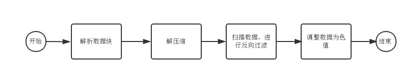

# png的故事：获取图片信息和像素内容

## 前言

现在时富媒体时代，图片的重要性对于数十亿互联网用户来说不言而喻，图片本身就是像素点阵的合集，但是为了如何更快更好的存储图片而诞生了各种各样的图片格式：jpeg、png、gif、webp等，而这次我们要拿来开刀的，就是png。

## 简介

首先，png是什么鬼？我们来看看wiki上的一句话简介：

> Portable Network Graphics (PNG) is a raster graphics file format that supports lossless data compression.

也就是说，png是一种使用**无损压缩**的图片格式，而大家熟知的另外一种图片格式——jpeg则是采用有损压缩的方式。用通俗易懂的方式来讲，当原图片数据被编码成png格式后，是可以完全还原成原本的图片数据的，而编码成jpeg则会损耗一部分图片数据，这是因为两者的编码方式和定位不同。jpeg着重于人眼的观感，保留更多的亮度信息，去掉一些不影响观感的色度信息，因此是有损耗的压缩。png则保留原始所有的颜色信息，并且支持透明／alpha通道，然后采用无损压缩进行编码。因此对于jpeg来说，通常适合颜色更丰富、可以在人眼识别不了的情况下尽可能去掉冗余颜色数据的图片，比如照片之类的图片；而png适合需要保留原始图片信息、需要支持透明度的图片。

以下，我们来尝试获取png编码的图片数据：

## 结构

图片是属于2进制文件，因此在拿到png图片并想对其进行解析的话，就得以二进制的方式进行读取操作。png图片包含两部分：文件头和数据块。

### 文件头

png的文件头就是png图片的前8个字节，其值为`[0x89, 0x50, 0x4E, 0x47, 0x0D, 0x0A, 0x1A, 0x0A]`，人们常常把这个头称之为“魔数”。玩过linux的同学估计知道，可以使用`file`命令类判断一个文件是属于格式类型，就算我们把这个文件类型的后缀改得乱七八糟也可以识别出来，用的就是判断“魔数”这个方法。有兴趣的同学还可以使用`String.fromCharCode`将这个“魔数”转成字符串看看，就知道为什么png会取这个值作为文件头了。

用代码来判断也很简单：

```js
// 读取指定长度字节
function readBytes(buffer, begin, length) {
    return Array.prototype.slice.call(buffer, begin, begin + length);
}

let header = readBytes(pngBuffer, 0, 8); // [0x89, 0x50, 0x4E, 0x47, 0x0D, 0x0A, 0x1A, 0x0A]
```

### 数据块

去掉了png图片等前8个字节，剩下的就是存放png数据的数据块，我们通常称之为`chunk`。

顾名思义，数据块就是一段数据，我们按照一定规则对png图片（这里指的是去掉了头的png图片数据，下同）进行切分，其中一段数据就是一个数据块。每个数据块的长度是不定的，我们需要通过一定的方法去提取出来，不过我们要先知道有哪些类型的数据块才好判断。

#### 数据块类型

数据块类型有很多种，但是其中大部分我们都不需要用到，因为里面没有存储我们需要用到的数据。我们需要关注的数据块只有以下四种：

* IHDR：存放图片信息。
* PLTE：存放索引颜色。
* IDAT：存放图片数据。
* IEND：图片数据结束标志。

只要解析这四种数据块就可以获取图片本身的所有数据，因此我们也称这四种数据块为**“关键数据块”**。

#### 数据块格式

数据块格式如下：

|描述|长度|
|:---|:---|
|数据块内容长度|4字节|
|数据块类型|4字节|
|数据块内容|不定字节|
|crc冗余校验码|4字节|

这样我们就可以轻易的指导当前数据块的长度了，即`数据块内容长度 + 12字节`，用代码实现如下：

```js
// 读取32位无符号整型数
function readInt32(buffer, offset) {
    offset = offset || 0;
    return (buffer[offset] << 24) + (buffer[offset + 1] << 16) + (buffer[offset + 2] << 8) + (buffer[offset + 3] << 0);
}

let length = readInt32(readBytes(4)); // 数据块内容长度
let type = readBytes(4); // 数据块类型
let chunkData = readBytes(length); // 数据块内容
let crc = readBytes(4); // crc冗余校验码
```

这里的crc冗余校验码在我们解码过程中用不到，所以这里不做详解。除此之外，数据块内容长度和数据块内容好解释，不过数据块类型有何作用呢，这里我们先将这个`type`转成字符串类型：

```js
// 将buffer数组转为字符串
function bufferToString(buffer) {
    let str = '';
    for(let i=0, len=buffer.length; i<len; i++){
        str += String.fromCharCode(buffer[i]);
    }
    return str;
}

type = bufferToString(type);
```

然后会发现type的值是四个大写英文字母，没错，这就是上面提到的数据块类型。上面还提到了我们只需要解析关键数据块，因此遇到`type`不等于IHDR、PLTE、IDAT、IEND中任意一个的数据块就直接舍弃好了。当我们拿到一个关键数据块，就直接解析其数据块内容就可以了，即上面代码中的`chunkData`字段。

### IHDR

类型为IHDR的数据块用来存放图片信息，其长度为固定的13个字节：

|描述|长度|
|:---|:---|
|图片宽度|4字节|
|图片高度|4字节|
|图像深度|1字节|
|颜色类型|1字节|
|压缩方法|1字节|
|过滤方式|1字节|
|扫描方式|1字节|

其中宽高很好解释，直接转成32位整数，就是这张png图片等宽高（以像素为单位）。压缩方法目前只支持一种（deflate/inflate 压缩算法），其值为0；过滤方式也只有一种（包含标准的5种过滤类型），其值为0；扫描方式有两种，一种是逐行扫描，值为0，还有一种是Adam7隔行扫描，其值为1，此次只针对普通的逐行扫描方式进行解析，因此暂时不考虑Adam7隔行扫描。

图片深度是指每个像素点中的每个通道（channel）占用的位数，只有1、2、4、8和16这5个值；颜色类型用来判断每个像素点中有多少个通道，只有0、2、3、4和6这5个值：

|颜色类型的值|占用通道数|描述|
|:---|:---|:---|
|0|1|灰度图像，只有1个灰色通道|
|2|3|rgb真彩色图像，有RGB3色通道|
|3|1|索引颜色图像，只有索引值一个通道|
|4|2|灰度图像 + alpha通道|
|6|4|rgb真彩色图像 + alpha通道|

alpha通道是用来支持透明度的，因此我们也可以很简单的计算出每个像素点的数据占用的位数：`图像深度 * 通道数`。

### PLTE

类型为PLTE的数据块用来存放索引颜色，我们又称之为“调色板”。

由IHDR数据块解析出来的图像信息可知，图像的数据可能是以索引值的方式进行存储。当图片数据采用索引值的时候，调色板就起作用了。调色板的长度和图像深度有关，假设图像深度的值是x，则其长度通常为`2的x次幂 * 3`。原因是图像深度保存的就是通道占用的位数，而在使用索引颜色的时候，通道里存放的就是索引值，2点x次幂就表示这个通道可能存放的索引值有多少个，即调色板里的颜色数。而每个索引颜色是RGB3色通道存放的，因此此处还需要乘以3。

> 通常使用索引颜色的情况下，图像深度的值即为8，因而调色板里存放的颜色就只有256种颜色，长度为`256 * 3`个字节。再加上1位布尔值表示透明像素，这就是我们常说的png8图片了。

### IDAT

类型为IDAT的数据块用来存放图像数据，跟其他关键数据块不同的是，其数量可以是**连续**的复数个；其他关键数据块在1个png文件里有且只有1个。

这里的数据得按顺序把所有连续的IDAT数据块全部解析并将数据联合起来才能进行最终处理，这里先略过。

```js
let dataChunks = [];
let length = 0; // 总数据长度

// ... 

while(/* 存在IDAT数据块 */) {
    dataChunks.push(chunkData);
    length += chunkData.length;
}
```

### IEND

当解析到类型为IEND的数据块时，就表明所有的IDAT数据块已经解析完毕，我们就可以停止解析了。

IEND整个数据块的值时固定的：`[0x00, 0x00, 0x00, 0x00, 0x49, 0x45, 0x4E, 0x44, 0xAE, 0x42, 0x60, 0x82]`，因为IEND数据块没有数据块内容，所以其数据块内容长度字段（数据块前4个字节）的值也是0。

## 解析

### 解压缩

当我们收集完IDAT的所有数据块内容时，我们要先对其进行解压缩：

```js
const zlib = require('zlib');

let data = new Buffer(length);
let index = 0;
dataChunks.forEach((chunkData) => {
    chunkData.forEach((item) => {data[index++] = item});
});

// inflate解压缩
data = zlib.inflateSync(new Buffer(data));
```

### 扫描

上面说过，此次我们只考虑逐行扫描的方式：

```js
// 读取8位无符号整型数
function readInt8(buffer, offset) {
    offset = offset || 0;
    return buffer[offset] << 0;
}

let width; // 解析IHDR数据块时得到的图像宽度
let height; // 解析IHDR数据块时得到的图像高度
let colors; // 解析IHDR数据块时得到的通道数
let bitDepth; // 解析IHDR数据块时得到的图像深度

let bytesPerPixel = Math.max(1, colors * bitDepth / 8); // 每像素字节数
let bytesPerRow = bytesPerPixel * width; // 每行字节数

let pixelsBuffer = new Buffer(bytesPerPixel * width * height); // 存储过滤后的像素数据
let offset = 0; // 当前行的偏移位置

// 逐行扫描解析
for(let i=0, len=data.length; i<len; i+=bytesPerRow+1) {
    let scanline = Array.prototype.slice.call(data, i+1, i+1+bytesPerRow); // 当前行
    let args = [scanline, bytesPerPixel, bytesPerRow, offset];

    // 第一个字节代表过滤类型
    switch(readInt8(data, i)) {
        case 0:
            filterNone(args);
            break;
        case 1:
            filterSub(args);
            break;
        case 2:
            filterUp(args);
            break;
        case 3:
            filterAverage(args);
            break;
        case 4:
            filterPaeth(args);
            break;
        default:
            throw new Error('未知过滤类型！');
    }

    offset += bytesPerRow;
}
```

上面代码前半部分不难理解，就是通过之前解析得到的图像宽高，再加上图像深度和通道数计算得出每个像素占用的字节数和每一行数据占用的字节数。因此我们就可以拆分出每一行的数据和每一个像素的数据。

在得到每一行数据后，就要进行这个png编码里最关键的1步——过滤。

### 过滤

早先我们说过过滤方法只有1种，其中包含5种过滤类型，图像每一行数据里的第一个字节就表示当前行数什么过滤类型。

png为什么要对图像数据进行过滤呢？

大多数情况下，图像的相邻像素点的色值时很相近的，而且很容易呈现线性变化（相邻数据的值是相似或有某种规律变化的），因此借由这个特性对图像的数据进行一定程度的压缩。针对这种情况我们常常使用一种叫**差分编码**的编码方式，即是记录当前数据和某个标准值的差距来存储当前数据。

比如说有这么一个数组`[99, 100, 100, 102, 103]`，我们可以将其转存为`[99, 1, 0, 2, 1]`。转存的规则就是以数组第1位为标准值，标准值存储原始数据，后续均存储以前1位数据的差值。

当我们使用了差分编码后，再进行**deflate**压缩的话，效果会更好（deflate压缩是LZ77延伸出来的一种算法，压缩频繁重复出现的数据段的效果是相当不错的，有兴趣的同学可自行去了解）。

好，回到正题来讲png的5种过滤类型，首先我们要定义几个变量以便于说明：

```
C B
A X
```

* X：当前像素。
* A：当前像素点左边的像素。
* B：当前像素点上边的像素。
* C：当前像素点左上边的像素。

### 过滤类型0：None

这个没啥好解释的，就是完全不做任何过滤。

```js
function filterNone(scanline, bytesPerPixel, bytesPerRow, offset) {
    for(let i=0; i<bytesPerRow; i++) {
        pixelsBuffer[offset + i] = scanline[i];
    }
}
```

### 过滤类型1：Sub

记录**X - A**的值，即当前像素和左边像素的差值。左边起第一个像素是标准值，不做任何过滤。

```js
function filterSub(scanline, bytesPerPixel, bytesPerRow, offset) {
    for(let i=0; i<bytesPerRow; i++) {
        if(i < bytesPerPixel) {
            // 第一个像素，不作解析
            pixelsBuffer[offset + i] = scanline[i];
        } else {
            // 其他像素
            let a = pixelsBuffer[offset + i - bytesPerPixel];

            let value = scanline[i] + a;
            pixelsBuffer[offset + i] = value & 0xFF;
        }
    }
}
```

### 过滤类型2：Up

记录**X - B**的值，即当前像素和上边像素点差值。如果当前行是第1行，则当前行数标准值，不做任何过滤。

```js
function filterUp(scanline, bytesPerPixel, bytesPerRow, offset) {
    if(offset < bytesPerRow) {
        // 第一行，不作解析
        for(let i=0; i<bytesPerRow; i++) {
            pixelsBuffer[offset + i] = scanline[i];
        }
    } else {
        for(let i=0; i<bytesPerRow; i++) {
            let b = pixelsBuffer[offset + i - bytesPerRow];

            let value = scanline[i] + b;
            pixelsBuffer[offset + i] = value & 0xFF;
        }
    }
}
```

### 过滤类型3：Average

记录**X - (A + B) / 2**的值，即当前像素与左边像素和上边像素的平均值的差值。

* 如果当前行数第一行：做特殊的Sub过滤，左边起第一个像素是标准值，不做任何过滤。其他像素记录该像素与左边像素的**二分之一**的值的差值。
* 如果当前行数不是第一行：左边起第一个像素记录该像素与上边像素的**二分之一**的值的差值，其他像素做正常的Average过滤。

```js
function filterAverage(scanline, bytesPerPixel, bytesPerRow, offset) {
    if(offset < bytesPerRow) {
        // 第一行，只做Sub
        for(let i=0; i<bytesPerRow; i++) {
            if(i < bytesPerPixel) {
                // 第一个像素，不作解析
                pixelsBuffer[offset + i] = scanline[i];
            } else {
                // 其他像素
                let a = pixelsBuffer[offset + i - bytesPerPixel];

                let value = scanline[i] + (a >> 1); // 需要除以2
                pixelsBuffer[offset + i] = value & 0xFF;
            }
        }
    } else {
        for(let i=0; i<bytesPerRow; i++) {
            if(i < bytesPerPixel) {
                // 第一个像素，只做Up
                let b = pixelsBuffer[offset + i - bytesPerRow];

                let value = scanline[i] + (b >> 1); // 需要除以2
                pixelsBuffer[offset + i] = value & 0xFF;
            } else {
                // 其他像素
                let a = pixelsBuffer[offset + i - bytesPerPixel];
                let b = pixelsBuffer[offset + i - bytesPerRow];

                let value = scanline[i] + ((a + b) >> 1);
                pixelsBuffer[offset + i] = value & 0xFF;
            }
        }
    }
}
```

### 过滤类型4：Paeth

记录**X - Pr**的值，这种过滤方式比较复杂，Pr的计算方式（伪代码）如下：

```
p = a + b - c
pa = abs(p - a)
pb = abs(p - b)
pc = abs(p - c)
if pa <= pb and pa <= pc then Pr = a
else if pb <= pc then Pr = b
else Pr = c
return Pr
```

* 如果当前行数第一行：做Sub过滤。
* 如果当前行数不是第一行：左边起第一个像素记录该像素与上边像素的差值，其他像素做正常的Peath过滤。

```js
function filterPaeth(scanline, bytesPerPixel, bytesPerRow, offset) {
    if(offset < bytesPerRow) {
        // 第一行，只做Sub
        for(let i=0; i<bytesPerRow; i++) {
            if(i < bytesPerPixel) {
                // 第一个像素，不作解析
                pixelsBuffer[offset + i] = scanline[i];
            } else {
                // 其他像素
                let a = pixelsBuffer[offset + i - bytesPerPixel];

                let value = scanline[i] + a;
                pixelsBuffer[offset + i] = value & 0xFF;
            }
        }
    } else {
        for(let i=0; i<bytesPerRow; i++) {
            if(i < bytesPerPixel) {
                // 第一个像素，只做Up
                let b = pixelsBuffer[offset + i - bytesPerRow];

                let value = scanline[i] + b;
                pixelsBuffer[offset + i] = value & 0xFF;
            } else {
                // 其他像素
                let a = pixelsBuffer[offset + i - bytesPerPixel];
                let b = pixelsBuffer[offset + i - bytesPerRow];
                let c = pixelsBuffer[offset + i - bytesPerRow - bytesPerPixel];

                let p = a + b - c;
                let pa = Math.abs(p - a);
                let pb = Math.abs(p - b);
                let pc = Math.abs(p - c);
                let pr;

                if (pa <= pb && pa <= pc) pr = a;
                else if (pb <= pc) pr = b;
                else pr = c;

                let value = scanline[i] + pr;
                pixelsBuffer[offset + i] = value & 0xFF;
            }
        }
    }
}
```

## 获取像素

到这里，解析的工作就做完了，上面代码里的`pixelsBuffer`数组里存的就是像素的数据了，不过我们要如何获取具体某个像素的数据呢？方式可参考下面代码：

```js
let palette; // PLTE数据块内容，即调色板内容
let colorType; // 解析IHDR数据块时得到的颜色类型
let transparentPanel; // 透明像素面板，解析tRNS数据块获得

function getPixel(x, y) {
    if(x < 0 || x >= width || y < 0 || y >= height) {
        throw new Error('x或y的值超出了图像边界！');
    }

    let bytesPerPixel = Math.max(1, colors * bitDepth / 8); // 每像素字节数
    let index = bytesPerPixel * ( y * width + x);

    switch(colorType) {
        case 0: 
            // 灰度图像
            return [pixelsBuffer[index], pixelsBuffer[index], pixelsBuffer[index], 255];
        case 2: 
            // rgb真彩色图像
            return [pixelsBuffer[index], pixelsBuffer[index + 1], pixelsBuffer[index + 2], 255];
        case 3: 
            // 索引颜色图像
            let paletteIndex = pixelsBuffer[index];
                
            let transparent = transparentPanel[paletteIndex]
            if(transparent === undefined) transparent = 255;

            return [palette[paletteIndex * 3 + 0], palette[paletteIndex * 3 + 1], palette[paletteIndex * 3 + 2], transparent];
        case 4: 
            // 灰度图像 + alpha通道
            return [pixelsBuffer[index], pixelsBuffer[index], pixelsBuffer[index], pixelsBuffer[index + 1]];
        case 6: 
            // rgb真彩色图像 + alpha通道
            return [pixelsBuffer[index], pixelsBuffer[index + 1], pixelsBuffer[index + 2], pixelsBuffer[index + 3]];
    }
}
```

> 此处用到了非关键数据块**tRNS**的数据，不过这里不做讲解，有兴趣的同学可去官网了解：[https://www.w3.org/TR/PNG/#11tRNS](https://www.w3.org/TR/PNG/#11tRNS)（此数据块的结构相当简单）

## 尾声

png的解析流程可以由这一张图简单概括：



此文只对png图片的格式做了简单的介绍，我们也知道如何对一张png图片做简单的解析。上面出现的代码只是js代码片段，如果对完整代码有兴趣的同学可以[戳这里](https://github.com/JuneAndGreen/doimg/blob/master/src/png.js)。

参考资料：

* [https://www.w3.org/TR/PNG/](https://www.w3.org/TR/PNG/)
* [http://www.libpng.org/pub/png/](http://www.libpng.org/pub/png/)
* [https://en.wikipedia.org/wiki/Portable_Network_Graphics](https://en.wikipedia.org/wiki/Portable_Network_Graphics)

