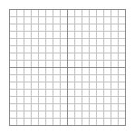
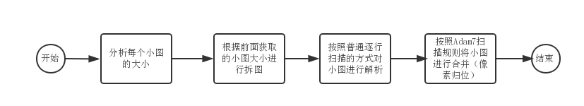

# png的故事：隔行扫描算法

## 前言

前文已经讲解过如何解析一张png图片，然而对于扫描算法里只是说明了逐行扫描的方式。其实png还支持一种隔行扫描技术，即Adam7隔行扫描算法。

## 优劣

使用隔行扫描有什么好处呢？如果大家有去仔细观察的话，会发现网络上有一些png图在加载时可以做到先显示出比较模糊的图片，然后逐渐越来越清晰，最后显示出完整的图片，类似如下效果：


这就是隔行扫描能带来的效果。隔行扫描一共会进行1到7次扫描，每一次都是跳着部分像素点进行扫描的，先扫描到像素点可以先渲染，每多一次扫描，图片就会更清晰，到最后一次扫描时就会扫描完所有像素点，进而渲染出完整的图片。

当然，也因为要进行跳像素扫描，整张图片会存储更多额外数据而导致图片大小会稍微变大，具体增加了什么额外数据下文会进行讲解。

## 生成

要导出一张基于Adam7隔行扫描的png图片是非常简单，我们可以借助Adobe的神器——PhotoShop（以下简称ps）。我们把一张普通的图片拖入到ps中，然后依次点选【文件】-【存储为Web所用的格式】，在弹出的框里选择存储为`PNG-24`，然后勾选**交错**，最后点击存储即可。

这里的交错就是只将扫描算法设为Adam7隔行扫描，如果不勾选交错，则是普通逐行扫描的png图片。

## 原理

Adam7隔行扫描算法的原理并不难，本质上是将一张png图片拆分成多张png小图，然后对这几张png小图进行普通的逐行扫描解析，最后将解析出来的像素数据按照一定的规则进行归位即可。

### 分析

在解压缩完图像数据后就要马上进行拆图。拆图并不难，就是将原本存储图像数据的Buffer数组拆分成多个Buffer数组而已。关键的问题是怎么拆，这时我们先祭上wiki上这张图：



上面这张图就说明了每次扫描需要扫描到的像素，正常来说一张基于Adam7隔行扫描的png图片是要经历7次扫描的，不过有些比较小的图片的实际扫描次数不到7次，这是因为有些扫描因为没有实际像素点而落空的原因，所以下面的讲解还是以标准的7次扫描来讲解，本质上此算法的代码写出来后，是能兼容任何大小的png图片的，因为算法本身和图片大小无关。

7次扫描，其实就回答了上面拆图的问题：要拆成7张小图。每张小图就包含了每次扫描时要归位的像素点。

以第一次扫描为例：第一次扫描的规则是从左上角（我们设定此坐标为(0,0)）开始，那么它扫描到的下一个点是同一行上一个点往右偏移8个像素，即(8,0)。以此类推，再下一个点就是(16,0)、（24,0）等。当当前行所有符合规则的点都扫描完时则跳到下一个扫描行的起点，即(8,0)，也就是说第一次扫描的扫描行也是以8个像素为偏移单位的。直到所有扫描行都已经扫描完成，我们就可以认为这次扫描已经结束，可以考虑进入第二次扫描。

我们以一张10\*10大小的png图片来举例，下面每个数字代表一个像素点，数字的值代表这个点在第几次扫描时被扫描到：

```
 1 6 4 6 2 6 4 6 1 6
 7 7 7 7 7 7 7 7 7 7
 5 6 5 6 5 6 5 6 5 6
 7 7 7 7 7 7 7 7 7 7
 3 6 4 6 3 6 4 6 3 6
 7 7 7 7 7 7 7 7 7 7
 5 6 5 6 5 6 5 6 5 6
 7 7 7 7 7 7 7 7 7 7
 1 6 4 6 2 6 4 6 1 6
 7 7 7 7 7 7 7 7 7 7
```

按照规则，在第一次扫描时我们会扫描到4个像素点，我们把这4个像素点单独抽离出来合在一起，就是我们要拆的第一张小图：

```
(1)  6   4   6   2   6   4   6  (1)  6
 7   7   7   7   7   7   7   7   7   7
 5   6   5   6   5   6   5   6   5   6
 7   7   7   7   7   7   7   7   7   7                   1 1
 3   6   4   6   3   6   4   6   3   6        ==>        1 1
 7   7   7   7   7   7   7   7   7   7
 5   6   5   6   5   6   5   6   5   6
 7   7   7   7   7   7   7   7   7   7
(1)  6   4   6   2   6   4   6  (1)  6
 7   7   7   7   7   7   7   7   7   7
```

也就是说，我们的第一张小图就是2\*2大小的png图片。后面的小图大小以此类推，这样我们就能得知拆图的依据了。

### 拆图

上面有提到，拆图本质上就是把存放图片数据的Buffer数组进行切分，在nodejs里的Buffer对象有个很好用的方法——slice，它的用法和数组的同名方法一样。

直接用上面的例子，我们的第一张小图是2\*2点png图片，在假设我们一个像素点所占的字节数是3个，那么我们要切出来的第一个Buffer子数组的长度就是`2*(2*3+1)`。也许就有人好奇了，为什么是乘以`2*3+1`而不是直接乘以`2*3`呢？之前我们提到过，拆成小图后要对小图进行普通的逐行扫描解析，这样解析的话每一行的第一个字节实际存放的不是图像数据，而是过滤类型，因此每一行所占用的字节需要在`2*3`的基础上加1。

### 像素归位

其他的小图拆分的方法是一样，在最后一次扫描完毕后，我们就会拿到7张小图。然后我们按照上面的规则对这些小图的像素进行归位，也就是填回去的意思。下面简单演示下归位的流程：

```
                (1) ( ) ( ) ( ) ( ) ( ) ( ) ( ) (1) ( )
                ( ) ( ) ( ) ( ) ( ) ( ) ( ) ( ) ( ) ( )
                ( ) ( ) ( ) ( ) ( ) ( ) ( ) ( ) ( ) ( )
 1 1            ( ) ( ) ( ) ( ) ( ) ( ) ( ) ( ) ( ) ( )
 1 1    ==>     ( ) ( ) ( ) ( ) ( ) ( ) ( ) ( ) ( ) ( )
                ( ) ( ) ( ) ( ) ( ) ( ) ( ) ( ) ( ) ( )
                ( ) ( ) ( ) ( ) ( ) ( ) ( ) ( ) ( ) ( )
                ( ) ( ) ( ) ( ) ( ) ( ) ( ) ( ) ( ) ( )
                (1) ( ) ( ) ( ) ( ) ( ) ( ) ( ) (1) ( )
                ( ) ( ) ( ) ( ) ( ) ( ) ( ) ( ) ( ) ( )
```

待到7张小图的像素全部都归位后，最后我们就能拿到一张完整的png图片了。

### 代码

整个流程的代码如下：

```js
let width; // 完整图像宽度，解析IHDR数据块可得
let height; // 完整图像高度，解析IHDR数据块可得
let colors; // 通道数，解析IHDR数据块可得
let bitDepth; // 图像深度，解析IHDR数据块可得
let data; // 完整图像数据

let bytesPerPixel = Math.max(1, colors * bitDepth / 8); // 每像素字节数
let pixelsBuffer = Buffer.alloc(bytesPerPixel * width * height, 0xFF); // 用来存放最后解析出来的图像数据

// 7次扫描的规则
let startX = [0, 0, 4, 0, 2, 0, 1];
let incX = [8, 8, 8, 4, 4, 2, 2];
let startY = [0, 4, 0, 2, 0, 1, 0];
let incY = [8, 8, 4, 4, 2, 2, 1];

let offset = 0; // 记录小图开始位置

// 7次扫描
for(let i=0; i<7; i++) {
        // 子图像信息
        let subWidth = Math.ceil((width - startY[i]) / incY[i], 10); // 小图宽度
        let subHeight = Math.ceil((height - startX[i]) / incX[i], 10); // 小图高度
        let subBytesPerRow = bytesPerPixel * subWidth; // 小图每行字节数
        let offsetEnd = offset + (subBytesPerRow + 1) * subHeight; // 小图结束位置
        let subData = data.slice(offset, offsetEnd); // 小图像素数据

        // 对小图进行普通的逐行扫描
        let subPixelsBuffer = this.interlaceNone(subData, subWidth, subHeight, bytesPerPixel, subBytesPerRow);
        let subOffset = 0;

        // 像素归位
        for(let x=startX[i]; x<height; x+=incX[i]) {
                for(let y=startY[i]; y<width; y+=incY[i]) {
                        // 逐个像素拷贝回原本所在的位置
                        for(let z=0; z<bytesPerPixel; z++) {
                                pixelsBuffer[(x * width + y) * bytesPerPixel + z] = subPixelsBuffer[subOffset++] & 0xFF;
                        }
                }
        }

        offset = offsetEnd; // 置为下一张小图的开始位置
}

return pixelsBuffer;
```

## 尾声

整个Adam7隔行扫描的流程大概就是这样：



前面提到基于此种扫描方式的png图片往往会更大些，这是因为图片存储了一些额外数据导致的。这里的额外数据就是指**过滤类型**。原本的png大图拆成小图后，扫描行的数目就会蹭蹭蹭往上涨，每个扫描行的第一个字节都是用来存储过滤类型的，所以行数增加的越多，额外数据就会越多。至于在用png图片等时候要选用哪种扫描方式等图片，就要视具体场景而定了。如果对完整代码有兴趣的同学可以[戳这里](https://github.com/JuneAndGreen/doimg/blob/master/src/png.js)。


参考资料：

* [https://www.w3.org/TR/PNG/](https://www.w3.org/TR/PNG/)
* [http://www.libpng.org/pub/png/](http://www.libpng.org/pub/png/)
* [https://en.wikipedia.org/wiki/Portable_Network_Graphics](https://en.wikipedia.org/wiki/Portable_Network_Graphics)


