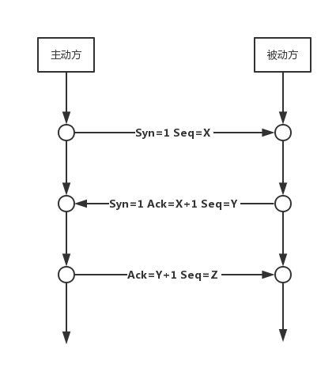
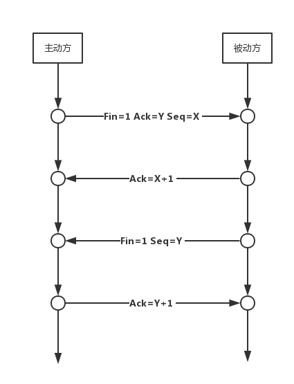
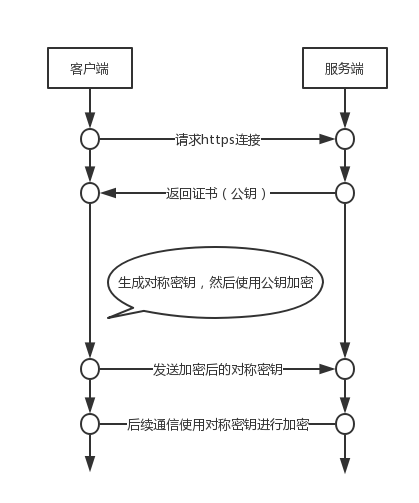

## 概述

网络由若干结点和连接这些结点的链路组成。互联网是“网络的网络”。

### 因特网

通信方式：

* 客户-服务器方式（C/S）
* 对等方式（P2P）

ps：internet（互联网），Internet（因特网）。

### 路由器

路由器是实现分组交换的关键构件，其任务是转发收到的分组。

路由器（输入和输出没有直接连线）主要做的工作：

* 收到的分组放入缓存
* 查找转发表
* 把分组送到适当的端口转发出去

### 计算机网络

定义：计算机网络是一些互相连接的、自治的计算机的集合。

* 带宽：数字信道所能传送的最高数据率。
* 吞吐量：在单位时间内通过某个网络（或信道、接口）的数据量（受带宽或速率限制）。
* 发送时延：数据帧长度（b）/发送速率（b/s）。
* 传播时延：信道长度（m）/传播速率（m/s）。
* 总时延：发送时延+传播时延+处理时延+排队时延（取决于网络当时通信量）.

### OSI七层模型

```
OSI          TCP/IP       OSI/RM
--------------------------------------
应用层
表示层        应用层        应用层      --->报文
会话层
--------------------------------------
运输层        运输层        运输层      --->报文段/用户数据报
--------------------------------------
网络层        网际层        网络层      --->IP数据报（分组）
--------------------------------------
数据链路层   网络接口层    数据链路层     --->帧
物理层                      物理层     --->比特
```

* 本层为上一层服务（垂直服务）
* 相邻两层实体交互的地方：服务访问点SAP
* 协议考虑了能想到的不利条件

## 物理层

涉及到物理层面的信息传输，规定了网络的电气特性，主要传输0和1的电信号。

## 数据链路层

封装数据成MAC帧，使用MAC地址标明接受者和发送者。

MAC地址共48位，MAC帧格式如下：

| 目的MAC地址 | 源MAC地址 | 类型 | ip数据报 | FCS（用于差错检测）|
|:---:|:---:|:---:|:---:|:---:|
| 6字节 | 6字节 | 2字节 | 46字节-1500字节 | 4字节 |

## 网络层

IP（IPv4）地址具体分类如下：

| 类型 | 网络号 | 主机号 |
|:---:|---|:---:|
| A | '0'    + 7位（全0和127不可用） | 24位（全0和全1不可用） |
| B | '10'   + 14位（无不可用） | 16位（全0和全1不可用） |
| C | '110'  + 21位（192不可用） | 8位（全0和全1不可用） |
| D | '1110' + 28位（多播地址） | 无 |
| E | '1111' + 28位（保留） | 无 |

ps：获取网络号的方式是将IP地址与子网掩码相与即可获得。
ps：ARP - 地址转换协议（自动进行，为了获取同一个子网络中的接收方的MAC地址，假如不处于同一个子网络中会由网关自行处理）

IP数据报格式：

| 版本 | 首部长度 | 区分长度 | 总长度 |  标识 | 标志 | 片偏移 | 生存时间 |  协议 | 首部检验和 | 源IP地址 | 目的IP地址 | 可选 | 填充 | 数据 |
|:---:|:---:|:---:|:---:|:---:|:---:|:---:|:---:|:---:|:---:|:---:|:---:|:---:|:---:|:---:|
| 4位 | 4位 | 1字节 | 2字节 | 2字节 | 3位 | 13位 | 1字节 | 1字节 | 2字节 | 4字节 | 4字节 | 可变 | 可变 | 不定 |

* 固定部分为20字节。
* 片偏移以8个字节为偏移单位（片偏移 * 8 = 分片起始地址），分片长度必须为8的整数倍。
* 标志中最低位MF=1表示后面还有分片，中间位DF=1表示不能呢个分片。
* 路由表包含的内容：目的主机所在网络、下一跳地址（封装在MAC帧中）和子网掩码。
* 路由分为静态路由和动态路由。

## 运输层

### 端口

端口共16位，其中0-1023属保留端口，1024-49151可用。

### UDP

UDP报文格式：

| 源端口 | 目的端口 | 长度 | 检验和 | 数据 |
|:---:|:---:|:---:|:---:|:---:|
| 2字节 | 2字节 | 2字节 | 2字节 | 不定 |

* 首部共8个字节。
* 检验和要用伪首部和首部加起来一起计算。

### TCP

TCP报文格式：

| 源端口 | 目的端口 | 序号 | 确认号 | 数据偏移 | 保留字段 | 标志 | 窗口 | 检验和 | 紧急指针 | 选项 | 填充 | 数据 |
|:---:|:---:|:---:|:---:|:---:|:---:|:---:|:---:|:---:|:---:|:---:|:---:|:---:|
| 2字节 | 2字节 | 4字节 | 4字节 | 4位 | 6位 | 6位 | 2字节 | 2字节 | 2字节 | 可变 | 不定 | 不定 |

* 固定首部20个字节。
* 数据偏移以4个字节为偏移单位。
* 检验和要用伪首部和首部加起来一起计算。

#### 三次握手



1. 主动方发送一个Syn包给被动方，等待对方响应。
2. 被动方返回Syn+Ack包，表示已确认。
3. 主动方再发送一个Ack包，表示已收到确认。

#### 四次挥手



1. 主动方发送Fin+Ack包，同时结束主动方的数据传输，等待对方响应。
2. 被动方返回Ack包，表示已确认。
3. 被动方发送Fin包，表示被动方的数据传输已结束。
4. 主动方返回Ack包，表示已收到确认。

#### 容错机制

* 超时重传：发送了Seq后，如果在一定时间内没有收到相应的Ack回复，则会认为报文丢失，会重传这个数据包。
* 快速重传：如果被动方发现数据包丢失，会发送Ack让主动方重传数据包。
* 流量控制：使用滑动窗进行流量的控制。
* 拥塞控制：用于控制网络拥塞的算法，主要包括：慢启动、拥塞避免（加法增加）、拥塞发生（乘性减少 ）、快速恢复。

> PS：Seq就是告诉接收方：我发送的数据是从Seq开始的。
> PS：Ack就是告诉接收方：我希望下次收到对端发过来的Seq序号。

## 应用层

### 常见协议端口号

| 应用层协议 | 传输层协议 | 端口号 |
|:---:|:---:|:---:|
| DNS | UDP | 53 |
| TFTP | UDP | 69 |
| DHCP | UDP | 67、68 |
| FTP | TCP | 20、21 |
| HTTP | TCP | 80 |
| POP3 | TCP | 110 |
| IMAP4 | TCP | 143 |
| SMTP | TCP | 25 |

### HTTP

#### 简介

HTTP由请求和响应构成，是一个标准的客户端服务器模型。HTTP是一个无状态的协议，web服务器只有在浏览器发送请求时才给予响应，浏览器的每次请求都是一次独立的存在，此次请求和之前的请求没有对应的关系，并且请求永远是由浏览器发送给web服务器，web服务器不会在没有请求的情况下响应浏览器。

HTTP协议通常承载于TCP协议之上，有时也承载于SSL/TLS协议层之上，这个时候，就成了我们常说的HTTPS。默认HTTP的端口号是80，HTTPS的端口号是443。

HTTP协议的工作流程如下：

```
建立连接 ----> 请求 ----> 响应 ----> 处理响应
```

#### 请求和响应

* 一般HTTP请求由请求行、消息报头、请求正文三个部分构成。请求行的格式：请求方法、请求URI、HTTP协议版本号。
* 一般HTTP响应则由状态行、消息报头、响应正文三个部分构成。状态行的格式：HTTP协议版本号、响应状态码、相应的状态描述。

#### 常见HTTP状态码

| 类型 | 解释 | 例子 |
|---|---|---|
| 1xx | 请求信息 | 无 |
| 2xx | 请求成功 | 200 - 成功 |
| 3xx | 跳转 | 301 - 永久跳转，302 - 临时跳转，304 - 文件未更新 |
| 4xx | 客户端请求异常 | 400 - 请求非法，403 - 禁止请求，404 - 请求不存在，405 - 方法不允许 |
| 5xx | 服务器异常 | 500 - 服务器异常，502 - 网关异常，503 - 服务器负载过重，504 - 网关超时 |

#### 常见HTTP方法

PUT、GET、DELETE、POST、PATCH。

#### Cookie和Session的区别

* Cookie是存储在客户端的，Session是存储在服务器端的。
* Session通过存储在Cookie中的sessionId来获取。
* 在保存相对安全性低的信息时候，可以考虑使用Cookie，在相对安全性要求高的信息时候，可以考试使用Session。毕竟Cookie存在客户端，其他人可以查找并分析的。
* Cookie存储是字符串类型的信息，而Session可以存储任何形式的信息。
* Cookie同一个域内共享，Session也不存在访问域的限制。

#### HTTP缓存

一、Expires策略

* Expires是web服务器响应消息头字段，告诉浏览器在过期时间前可取缓存。
* Expires是HTTP1.0的东西，现在基本不用。

二、Cache-control策略

与Expires类似，拥有更多功能，且优先级高于Expires。其值可取：

* public：响应可被任何缓存区缓存。
* private：对于单个用户的单个或部分响应消息，不能被共享缓存处理，这允许服务器仅仅描述用户的部分响应消息，此响应消息对于其他用户的请求无效。
* no-cache：请求或响应消息不能缓存。
* no-store：用于防止重要的信息被无意地发布，在请求消息中发送将使得请求和响应的消息都不能使用缓存。
* max-age：客户机可以接收生存期不大于指定时间（以秒为单位）的响应。
* min-fresh：客户机可以接收响应时间小于当前时间加上指定时间之和。
* max-state：客户机可以接收超出超时期限一小段范围时间内的响应消息。那一小段时间范围由max-state指定。

需配合Cache-control一起使用的声明：

1、Last-Modified / If-Modified-Since

* Last-Modified：标示这个响应资源的最后修改时间。
* If-Modified-Since：当资源过期时（使用Cache-Control标识的max-age），发现资源具有Last-Modified声明，则再次向web服务器请求时带上请求头If-Modified-Since，表示请求时间。web服务器收到请求后发现有请求头If-Modified-Since，则与请求资源的最后修改时间进行比对，若最后修改时间较新，说明资源有被修改过，则响应整片资源内容和HTTP200；若较旧，说明资源无修改，则响应HTTP304（无须响应包体，节省浏览），告诉浏览器继续使用保存的cache；

2、Etag / If-None-Match

* Etag：web服务器响应请求时，告诉浏览器当前资源在服务器的唯一标识（由服务武器决定）。
* If-None-Match：当资源过期时，发现资源具有Etag声明，则再次向web服务器请求时带上请求头If-None-Match（Etag的值），web 服务器收到请求后发现有请求头If-None-Match则与被请求资源的相应校验串进行比对，决定相应HTTP200或HTTP304。

3、Last-Modified和Etag的使用区别

* Last-Modified只精确到秒级，当文件在1s内被多次修改，则难以获取文件修改时间。
* 有些文件被定期生成，内容不变Last-Modified却改变了，这样就无法使用Last-Modified缓存。
* 可能存在服务器没有准确获取文件修改时间，或者服务器与代理服务器时间不一致等情形。

PS：Etag是服务器自动生成或者由开发者生成的对应资源在服务器端的唯一标识符，能够更加准确的控制缓存。Last-Modified与ETag是可以一起使用的，服务器会优先验证ETag，一致的情况下，才会继续比对Last-Modified，最后才决定是否返回304。

4、缓存有效性

| 操作 | Expires/Cache-Control | Last-Modified/Etag |
|---|---|---|
| 地址栏回车 | 有效 | 有效 |
| 页面链接跳转 | 有效 | 有效 |
| 新开窗口 | 有效 | 有效 |
| 前进、后退 | 有效 | 有效 |
| F5刷新 | 无效 | 有效 |
| Ctrl+F5刷新 | 无效 | 无效 |

### HTTPS

HTTPS是在HTTP的基础上追加了SSL/TLS协议。具体流程如下：



加密有两种，对称与非对称。https中是由浏览器端生成对称密钥，然后通过非对称加密将该队成密钥传给服务端，后续的通信则通过此对称密钥进行加密。

#### 对称加密

对称加密的密钥既可用来加密，亦可用来解密。

#### 非对称加密

非对称加密里包含公钥和私钥，公钥加密只能由私钥解密，私钥加密只能由公钥解密。公钥通常是公开的，而私钥则由服务器保有。非对称的两个缺点：加解密速度慢和数据传输单向安全（因为公钥是公开的，因此服务器发来的消息任何公钥持有者都可以解密）。

#### 证书

证书由CA颁发，通常会包含以下几个部分：

* 证书相关信息，如证书颁发机构（CA）、有效期等。
* 数字签名。
* 数字签名用到的hash算法。
* 公钥。

其中数字签名是通过某个hash算法对证书内容进行计算，将得到的“摘要”再使用私钥加密生成的结果。数字签名可用于证书防伪。

## 各层应用简介

* 物理层：转发器、调制解调器（接入Internet）、中继器（扩大传输距离）、集线器（多接口中继器，扩大传输距离）
* 链路层： 网桥、交换机（多接口网桥，转发）、网卡（适配器，用于接入局域网）
* 网络层：路由器（连接同类型不同网络）
* 传输层：防火墙、VPN、网关（本网标记，连接不同类型的网络）
